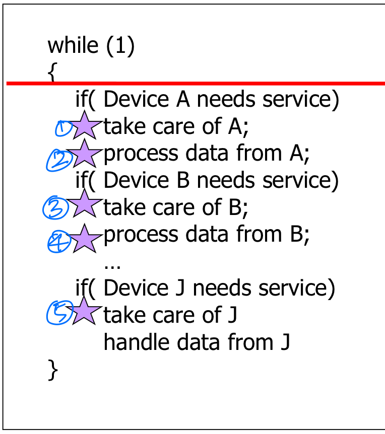
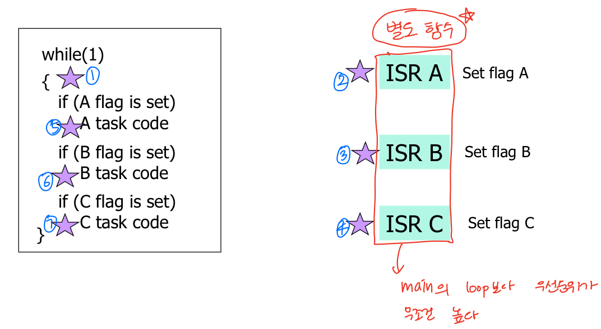
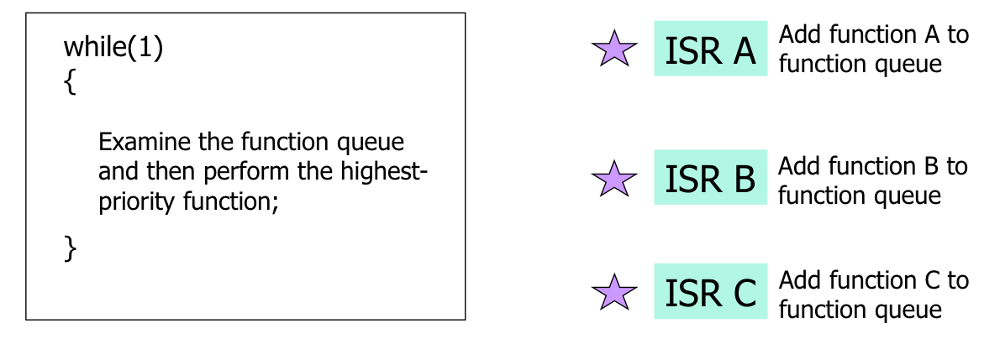
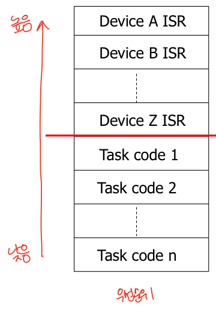

# 임베디드 소프트웨어 구조
## 디바이스 핸들링 프로세스
1. Interrupt Service Routine(ISR)   
    * 외부에서 온 데이터 처리
    * 핸들러를 빠르게 실행시켜야 함
2. Data Processing Routine(Task routine)
    * 디바이스로부터 얻은 데이터를 연산
    * ISR에 비해 오래 걸림

## 1. Round-robin
   

* 모든 디바이스를 번갈아가며 서비스가 필요한지 체크
* ISR 없음
* 문제점 : 큐가 많아지면 대기 시간이 너무 길어진다.

## 2. Round-robin with interrupt
   

* ISR이 별도의 함수(flag 세팅하는 역할)로 존재
* 서비스가 필요한 디바이스에 flag를 설정한다.
* main에서 flag가 setting되어 있는지 확인한 후 task 코드를 실행한다.
* ISR 함수들은 같은 우선순위이기 때문에 FIFO로 처리된다.
* task 코드에는 우선순위가 없다.

## 3. Function queue scheduling

* ISR이 별도의 함수(function queue에 함수를 추가하는 역할)로 존재
* task 코드가 함수 형태로 존재한다.
* task 코드에 우선순위가 있다. -> 낮은 우선순위 함수는 실행되지 않을 수 있다.
* 문제점 : **no preemption** 
    - 우선순위가 낮은 task code function이 길면, 우선 순위가 높은 task code 함수가 실행되지 않을 수 있다.

## 4. Real-time operating system

* task routine 간의 **preemption**이 있다.
* 스케줄러가 task 실행 순서를 결정한다.
* deadline을 보장받을 수 있다.

## 5. Embedded Linux

## 요약
| |RR|RR with interrupt|function queue|RTOS|
|---|---|---|---|---|
|ISR|X|flag 세팅|function queue에 함수 추가|존재|
|task 코드 형태|main|main|별도 함수|별도 함수|
|task 실행 순서|main 순서대로|flag 순서대로|function queue 순서대로|ISR|
|task 우선 순위|X|X|O|O|
|preemption|X|X|X|**O**|
|문제점|대기 시간 김||no preemption||
