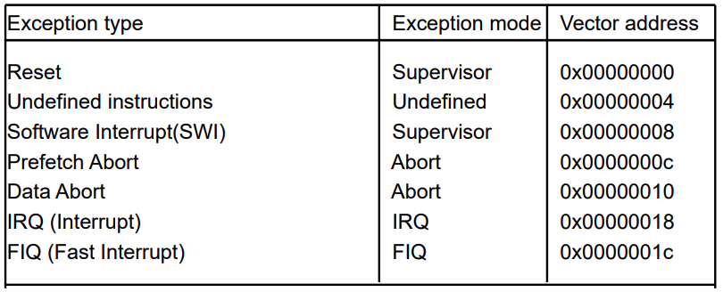
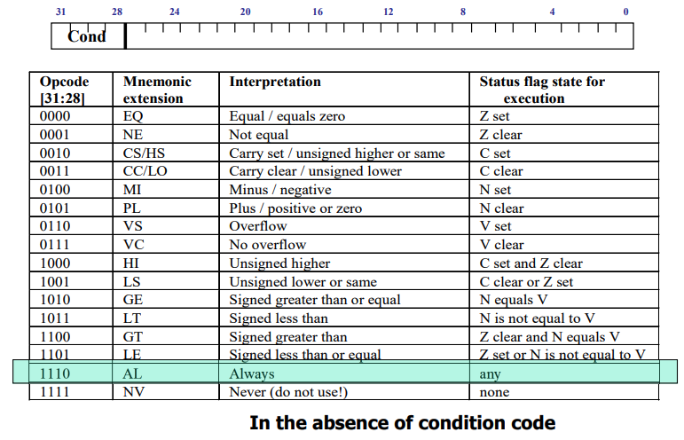
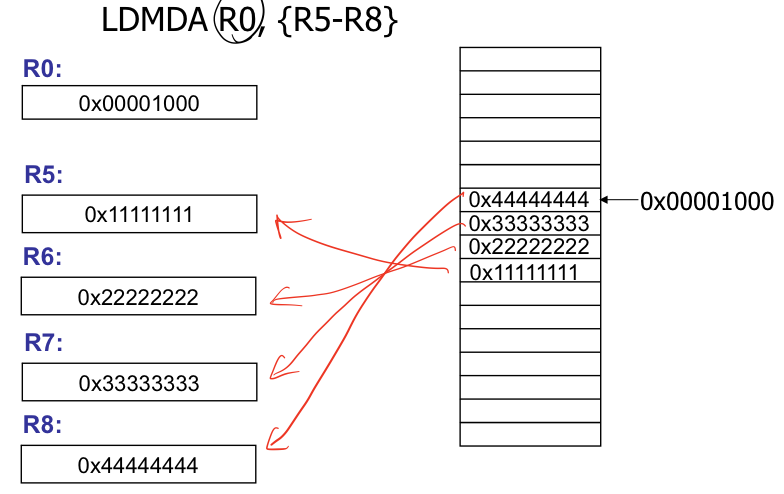

# 10 ARM
1. [ARM 아키텍쳐](#1-ARM-아키텍쳐)
2. [Programmer's model](#2-Programmer's-model)
3. [Instruction set](#3-Instruction-set)

* * *

## 1. ARM 아키텍쳐
* ARM : Advanced RISC Machines

#### 주요 특징
1. 균일한 레지스터(32bit)
2. Load/Store architecture
    - 메모리의 내용에 직접 연산할 수 없고, 레지스터의 내용에서만 데이터 연산이 가능하다
3. Simple address modes
    - register contents와 instruction fields부터로만 주소가 결정된다.
4. 균일하고 고정된 instruction fields

* 그 외
    - little/big endians

        

    - Thumb mode
        + ARM instruction(32bit)의 절반 사이즈(16bit)
    - Load/Store multiple instructions
    - Pipelining
    - Memory-mapped I/O
    - Barrel Shifter
    - Conditional instruction

* * *

## 2. Programmer's model
#### 프로세서 모드
- Unprivileged modes
    + 하드웨어에 접근하거나 모드를 변경할 수 없음
    + 종류
        + User mode(usr) : 일반 프로그램 실행 상태
- Privileged modes / Exception modes
    + 보호된 시스템 리소스에 접근하거나 모드 변경 가능
    + 종류
        + FIQ mode(fiq) : Fast interrupt
        + IRQ mode(irq) : interrupt 핸들링할 때
        + Supervisor mode(svc) : OS를 위한 보호 모드
        + Abort mode(abt) : 데이터 혹은 instruction prefetch abort
        + Undefined mode(und) : 정의할 수 없는 instruction이 실행되었을 때
- system mode
    + exception으로 enter되지 않고 유저모드와 같은 레지스터를 사용 가능하다
    + 하지만 privileged mode임

#### 레지스터
* 37개 존재

#### general purpose register
* 32개
* 32 bits wide


* 모드마다 사용 레지스터가 다름
* 공통으로 사용하는 레지스터 : R0 ~ R7
* 그 외 레지스터 :  R8 ~ R14
    - 현재 프로세서 모드에 따라 각기 다른 물리적 레지스터가 참조됨
* 언제나 15개의 레지스터 사용
* 시스템 모드에서는
    - 유저모드와 같은 레지스터를 사용
    - 추가적인 레지스터는 사용하지 않고 시스템 리소스에 접근하는 것을 필요로 하는 OS Task에서 사용
* Special register
    - R13 : Stack Pointer
    - R14
        + Link Register
        + 주소를 리턴한다.
        + exception이 발생하면, exception 리턴 주소를 저장한다.
        + R14_svc가 예외 핸들링이 완료될 때 주소를 다시 리턴해준다.
    - R15
        - Program Counter
        - 다음 instruction(fetch)의 주소를 저장한다.

#### status register
- 6개
- 32 bits wide
- 1 CPSR(Current Program Status Register)
- 5 SPSR(Saved Program Status Register)


1. Condition code flags
2. reserved
3. Control bits
4. Mode bits

### Exception Handling


1. CPSR를 SPSR_irq에 저장한다.
    - 예외처리가 끝난 후 다시 usr mode로 복원하기 위해서
2. CPSR bit를 적절하게 설정한다
    
    

    - CPSR[4:0] = 0x10010, CPSR[5] = 0, CPSR[7] = 1
    - (Mode bits) mode filed bits
    - (Control bits) 필요하면 ARM 상태에 enter
    - (Control bits) 필요시 interrupt disable flag
3. 적절한 banked register에 mapping
4. 처리가 끝난 후 다시 복원할 주소를 LR_irq에 저장
5. PC를 vector address로 설정

    

    - vector address에는 `b` 명령어가 들어 있음
    - `b reset_handle` 이면 `reset_handle`명령이 있는 자리로 점프

* * *

## 3. Instruction set
* ARM ISA : Instruction Set Architecture
* 모든 ARM instructions는 4bit condition field를 가지고 있다.
    - 시간적 코드크기적 효율적인 branch를 위해 condition field 사용

* 종류
    - Branch instructions
    - Data-processing instructions
    - Status register transfer instructions
    - Load and store instructions
    - Coprocessor instructions
    - Exception-generating instructions



* condition fields을 사용하기 위해
    - add instruction은 이런 형태를 가짐
        ```
        ADD r0, r1, r2      ;r0 = r1 + r2(ADDAL)
        ```
    - zero flag가 세팅되어 있으면
        ```
        ADDEQ r0, r1, r2    ;r0 = r1 + r2
        ```

* 표준 operand와 데이터 흐름 형식
```
ADD r0, r1, r2      ; r0 = r1 + r2
ADD Rd, Rm, Rn
```

    - Rn : Operand1, 항상 레지스터
    - Rm : Operand2, 레지스터 혹은 immediate value 혹은 shifter operand


### Data Processiong instuctions
* 산술 연산
* 논리 연산
* 비교 연산
* 레지스터간 데이터 이동


### Branch instructions
* 형식
    - Branch : B{<cond>} targe address
    - Branch with Link : BL{<cond>} func

* MRS : Status Register에서 Register로 이동
* MSR : Register에서 Status Register로 이동
* fields
    - c : CPSR[7:0], 최하위 8bit
    - x : CPSR[15:8], 
    - s : CPSR[23:16], 
    - f : CPSR[31:24], 최상위 8bit
* 예시

    


### Load and store instructions
* ARM은 load/store architecture이다.
    - 메모리 to 메모리 복사가 없음
    - 메모리에 접근해서 load와 store instruction만 사용

#### Single register data transfer
* 형식
    - <LDR|STR>{<conde>}{<size>} Rd, <address>
    - LDR/STR : Load/Store word
    - LDRB/STRB : Load/Store byte
    - LDRH/STRH : Load/Store halfword

* Addressing mode
    - Base register : PC를 포함한 General-purpose register
    - offset : 메모리 주소로부터 더하고 빼는 그 값

* Offset
    - Immediate : unsigned 12bit immediate value
    - Register : PC가 아닌 Getneral-purpose register
    - Scaled register : immediate value로부터 shift된 general-purpose register

* 방법
    1. offset
        
        

        1. R1 : base register
        2. base register에서 offset만큼 더하거나 뺌
        3. R0 : 거기에 들어 있는 값

    2. pre-indexed

        

        1. R1 : base register
        2. base register에서 offset만큼 더하거나 뺌
        3. R0 : 거기에 들어있는 값
        4. R1 : base register + off 주소값
    
    3. post-indexed

        

        1. R1 : base register
        2. R0 : base register에 들어 있는 값
        3. base register에서 offset만큼 더하거나 뺌
        4. R1 : base register + off 주소값

#### Block register data tranfer
- LDM, STM
- 1~16 레지스터와 메모리 데이터 전송
- 가장 낮은 레지스터의 번호가 항상 가장 낮은 메모리에 위치
- context 정보를 저장/다시 불러옴에 효율적임
- 메모리에서 큰 블럭의 데이터 단위로 이동
- subroutine call, stack operation에 사용
    - 예시
    ```
    Call a subroutine
    STMFD R13!, {R0-R12, LR} ; stack all registers

    Return from a subroutine
    LDMFD R13!, {R0-R12, PC} ; load all the registers
    ```

* Address mode
    - DA : Decrement after

        

    - IA : Increment after

        

    - DB : Decrement before

        

    - IB : Increment before

        

    - FD : Full decending

        

    - FA : Full ascending
    - ED : Empty descending
    - EA : Empty ascending

* Stack operation
    - full stack : 마지막으로 사용된 위치를 가리키는 스택 포인터
    - empty stack : 사용되지 않은 것 중 첫 번째 위치를 가리키는 스택 포인터
    - descending stack : 메모리 주소가 감소하는 방향으로 진행
    - ascending stack : 메모리 주소가 증가하는 방향으로 진행

* 예시
    ```
    LDMIA R0, {R5-R8}
    ```


