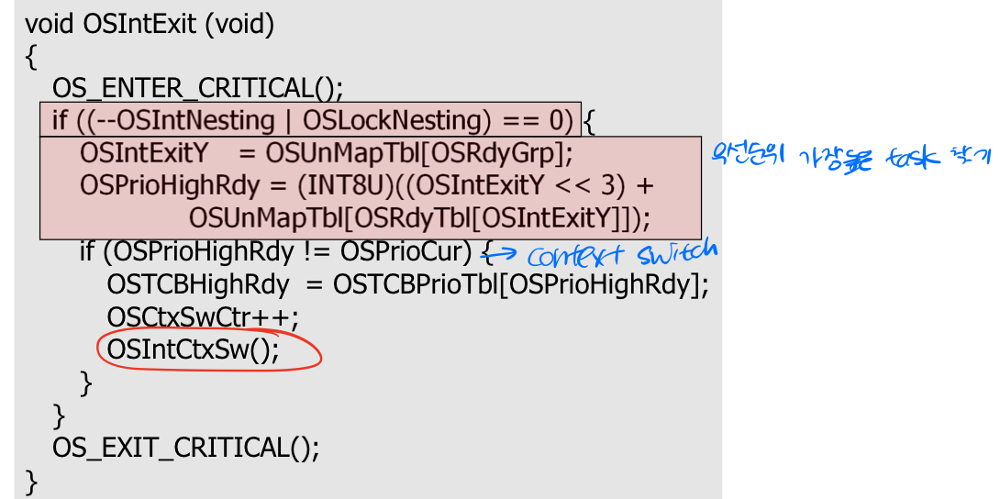

# kernel
* task의 수 : 64
* static priority scheduling
* `OSTaskChangePrio()` 함수를 사용하여 우선 순위 변경
### task state

|state|desc|
|---|---|
|dromant|잠자는|
|ready|스케줄링이 될 준비가 된|
|running|CPU가 실행 중인|
|wait|스케줄링 될 수 없음|
|ISR|interrupt routine 실행 중|

## Task Control Block(TCB)
* task에 대한 정보를 가지고 있음
* task가 스케줄링될 때, 정보가 실행을 위해 사용됨

### OS_TCB 구조
|name|desc|
|---|---|
|OSTCBStkPtr|stack의 top을 가리키는 포인터|
|OSTCBExtPtr *|별도로 정의된 TCB 가리키는 포인터|
|OSTCBStkBottom *|stack의 bottom을 가리키는 포인터|
|OSTCBStkSize|stack size|
|OSTCBNext/Prev|OS_TCB 링크드 리스트에 사용되는 포인터|
|OSTCBOpt|
|OSTCBDly|timeout까지 남은 clock tick의 수
|OSTCBState|Task state|

## Scheduler function
1. `OS_Sched()`
    * task 수준 스케줄링   
    * task 수행 중 필요에 따라 호출(wait->ready)   
       
2. `OSIntExit()`   
    * ISR 수준 스케줄링
    * interrupt 함수가 끝날 때 자동으로 호출(스케줄링 위해)
        
        
         
    * `OSIntCtxSw()`
        - `OSIntExit()` 함수에서 context switch 수행
        - `OSCtxSw()`와 다른 점은, ISR에서 task를 수행시키므로 이전 task의 context save가 없다.
### Clock tick
`OSTickISR()`   
* timeout과 시간 지연 기능을 위해 clock tick 사용   
   

