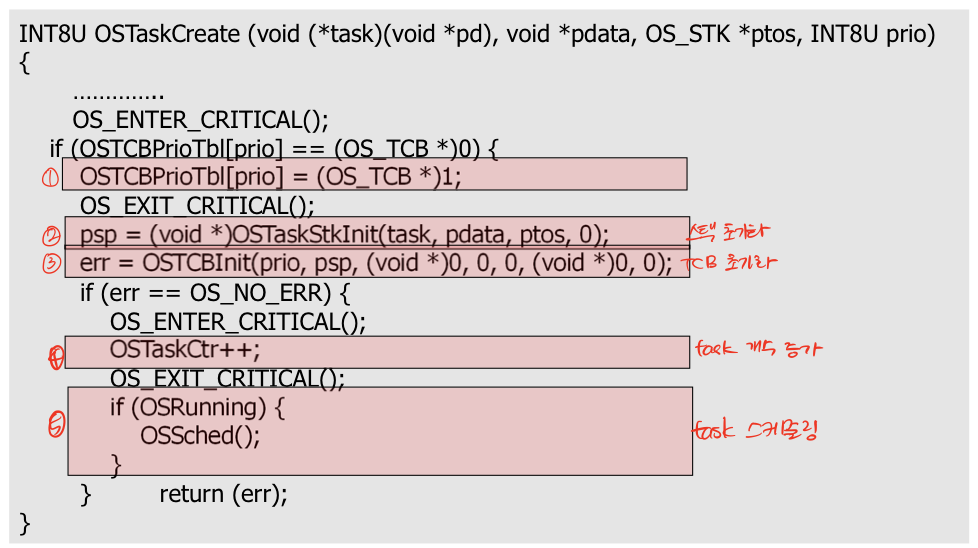
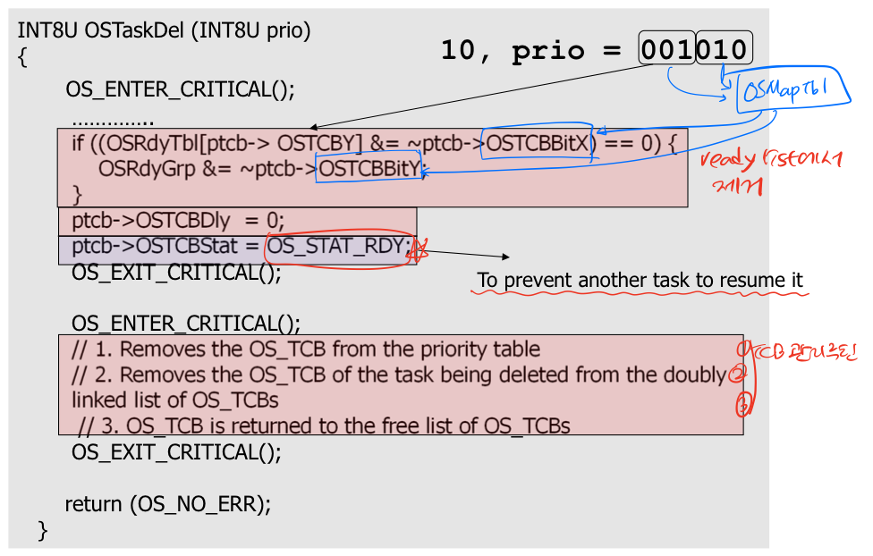
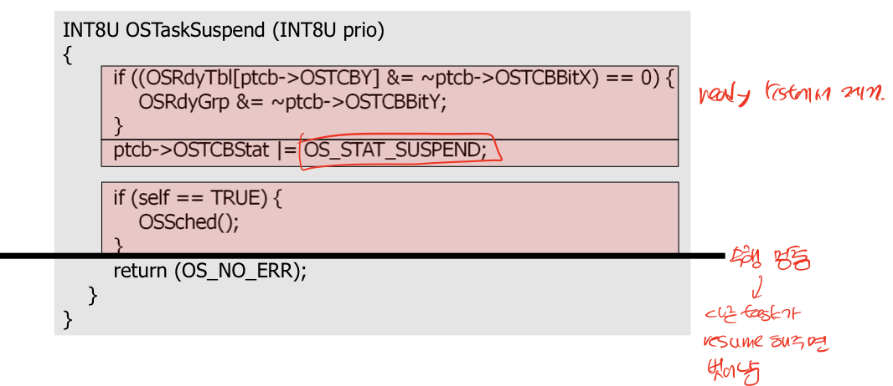
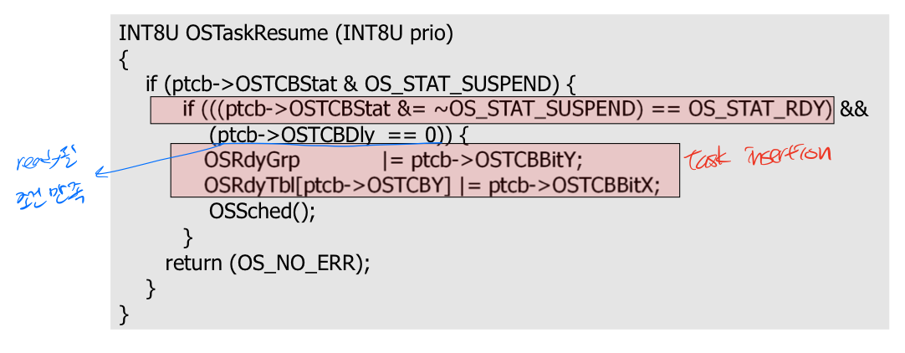

# Task management
## Task operation
### Creation
```c++
OStaskCreate(
    void(*task)(void* pd),      // task의 시작 번지
    void* pdata                 // task로 넘겨줄 전달인자
    OS_STK* ptos,               // task의 stack 사용 시작 번지
    INT8U prio                  // task의 우선 순위
);
```


* `OStaskCreateExt()`
    - 전달인자 9개
    - 8번째 인자 | stack checking or stack clearing

### Deletion


### Suspension


### Resumption

