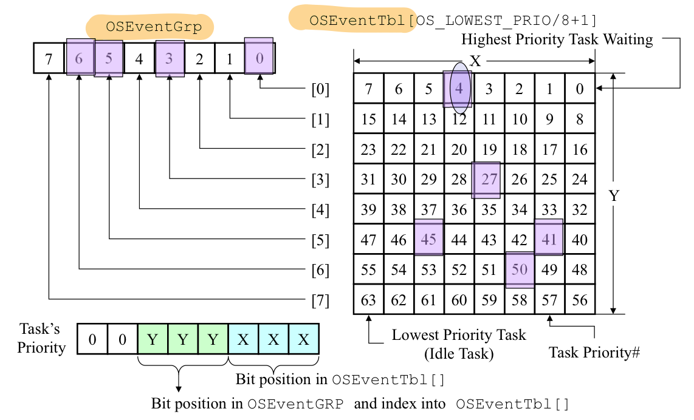
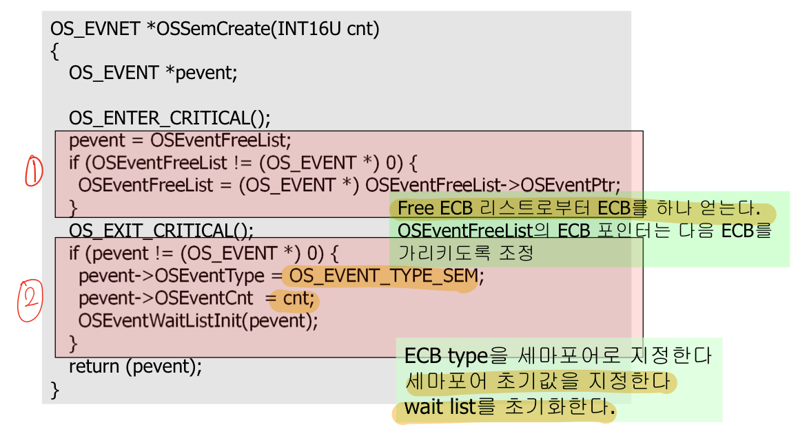
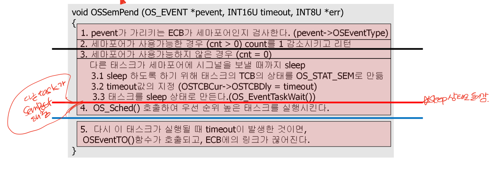
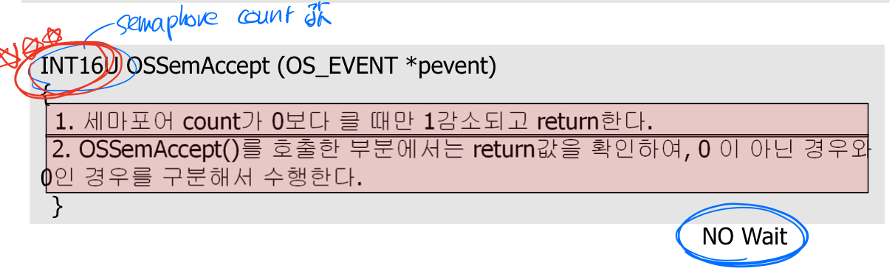
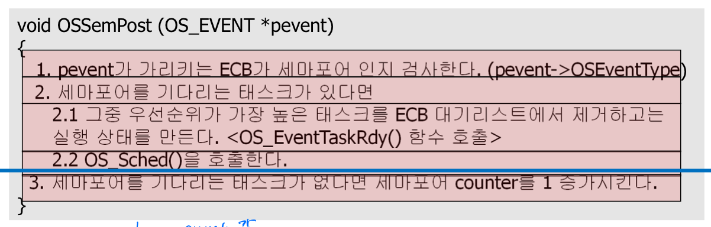

# Synchronization
* [Event Control Block(ECB)](#Event-Control-Block(ECB))   
* [Mailbox](#Mailbox)   
* [Message Queue](#Message-Queue)   
* [Semaphore](#Semaphore)   
* [Event flag](#Event-flag)   

## Event Control Block(ECB)
* Semaphore(Sem), mutex(Mutex), message queue(Q), mailbox(Mbox)
    - OS___Create
    - OS___Del
    - OS___Pend
    - OS___Post
    - OS___Accept
    - OS___Query
* event flag는 아님

### 구조
* OSEventType
    - OS_EVENT_TYPE_SEM
    - OS_EVENT_TYPE_MUTEX
    - OS_EVENT_TYPE_MBOX
    - OS_EVENT_TYPE_Q
* OSEventCnt
    - 세마포어 : 세마포어 카운트 저장
    - 뮤텍스 : PIP(priority inversion priority) 저장
* OSEventPtr
    - 메일박스나 메세지 큐일 때만 사용
* OSEventGrp, OSEventTbl[]
    - OSRdyGrp, OSRdyTbl[]과 비슷
    - 이벤트의 발생을 기다리는 태스크들의 리스트
    

### kernel functions
|function name|설명|호출 함수|
|---|---|---|
|`OS_EventWaitListInit()`|ECB 초기화|`OS___Create()`|
|`OS_EventTaskRdy()`|wait 중인 task 중 우선순위 가장 높은 태스크 실행|`OS___Post()`|
|`OS_EventWait()`|task를 준비 리스트에서 삭제, 대기 리스트에 삽입|`OS___Pend()`|
|`OS_EventTO()`|wait하다가 timeout 발생하여 준비 상태 만들기|`OS___Pend()`|

### operating
#### Event insertion
```c++
OSEventGrp |= OSMapTbl[prio>>3];
OSEventTbl[prio >> 3] |= OSMapTbl[prop & 0x07];
```
#### Event deletion
```c++
// Task 그룹 내에 다른 대기 중인 task가 남아 있는지 체크해서
if( ( OSEventTbl[prio >> 3] &= ~OSMapTbl[prio & 0x07] ) == 0 )
    // 없을 경우 해당 OSEventGrp bit도 0으로 초기화
    OSEventGrp &= ~OSMapTbl[prio>>3];
```
#### Searching the highest priority
```c++
y = OSUnMapTbl[OSEventGrp];
x = OSUnMapTbl[OSEventTbl[y]];
prio = (y << 3) + x;
```
### Free event control block list
* OS_INIT이 호출되면 모든 ECB는 free ECB list에 연결
* 세마포어나 메일박스, 큐가 생성되면 free ECB list에서 삭제되고 초기화됨

* * *
## Mailbox
* 생성
    ```c++
    OS_EVENT *OSMboxCreate(void* msg);      // 메세지에 대한 포인터
    ```
* 삭제
    ```c++
    OS_EVENT *OSMboxDel(OS_EVENT* pevent, INT8U opt, INT8U *err)
    ```
    - option
        + OS_DEL_NO_PEND : 기다리는 프로세스가 없는 경우
        + OS_DEL_ALWAYS : 있던 없던 무조건
* Pend
    ```c++
    void *OSMboxPend(OS_EVENT* pevent, INT16U timeout, INT8U* err)
    ```
    - timeout
        + 0 일 경우 무한정 대기
    - OSEventPtr
        + NULL : timeout 동안 대기
        + !NULL : OSEventPtr값을 msg에 저장한 후 메일박스 비움
* 기다리지 않고 Pend
    ```c++
    void* OSMboxAccept(OS_EVENT* pevent)
    ```
    - 메세지 없을 경우 waiting하지 않고 다음 작업 수행
* Post
    ```c++
    INT8U OSMboxPost(OS_EVENT* pevent, void* msg)
    ```
* Broadcast Post
    ```c++
    INT8U OSMboxPostOpt(OS_EVENT* pevent, void* msg, INT8U opt)
    ```
    - opt : OS_POST_OPT_BROADCAST

#### 예시
```c++
// 선언
OS_EVENT* mbox_send_voting;

// 생성
mbox_send_voting = OSMboxCreate((void*)0);

// 받기
char get_voting_result;
get_voting_result = (char*)OSMboxPend(mbox_send_voting, 0, &err);

// 보내기
char voting_result;
OSMboxPost(mbox_send_voting, (void*)&voting_result);
```

* * *
## Message Queue
* 생성
    ```c++
    OS_EVENT *OSQCreate(void** start, INT16U size); // 메세지 담을 포인터 배열
    ```
* 삭제
    ```c++
    OS_EVENT *OSQFlush(OS_EVENT* pevent)
    ```
    - 큐에 배달된 모든 메세지 삭제
* Pend
    ```c++
    void *OSQPend(OS_EVENT* pevent, INT16U timeout, INT8U* err)
    ```
    - timeout
        + 0 일 경우 무한정 대기
    - 큐에 메세지가 없으면 task sleep
* 기다리지 않고 Pend(Accept)
    ```c++
    void* OSQAccept(OS_EVENT* pevent)
    ```
    - 메세지 없을 경우 waiting하지 않고 다음 작업 수행
* Post
    ```c++
    INT8U OSQPost(OS_EVENT* pevent, void* msg)
    ```
* Broadcast Post
    ```c++
    INT8U OSQPostOpt(OS_EVENT* pevent, void* msg, INT8U opt)
    ```
    - opt : OS_POST_OPT_BROADCAST

#### 예시
```c++
// 선언
void *MsgQueue[20];
OS_EVENT* MsgQueue;

// 생성
MsgQueue = OSQCreate(&MsgQueue[0], 20);

// 받기
char get_voting_result;
get_voting_result = *(char*)OSQPend(MsgQueue, 0, &err);

// 보내기
char voting_result;
OSMboxPost(MsgQueue, (void*)&voting_result);
```

* * *
## Semaphore
* 생성
    ```c++
    OS_EVENT *OSSemCreate(INT16U initValue);      // 세마포어 초기값
    ```
    
* Pend
    ```c++
    void *OSSemPend(OS_EVENT* pevent, INT16U timeout, INT8U* err)
    ```
    
    - 세마포어 이벤트 발생을 기다림(waiting)
    - 세마포어 값 1 감소
        + 양수 : success
        + 0 : 다른 task가 깨워줄 때까지 waiting
* Accept(기다리지 않고 Pend)
    ```c++
    void* OSSemAccept(OS_EVENT* pevent)
    ```
    
    - 세마포어 사용 가능하지 않더라도 waiting하지 않고 다음 작업 수행
* Post
    ```c++
    INT8U OSSemPost(OS_EVENT* pevent, void* msg)
    ```
    
    - 세마포어 이벤트 발생 알림(signal)
    - 세마포어 waiting task 중 가장 우선 순위가 높은 태스크가 실행
    
### 사용 유형
1. 공유 변수 접근
    ```c++
    OS_EVENT* sem;
    sem = OSSemCreate(1);

    OSSemPost(sem, 0, &err);
    공유 변수
    OSSemPend(sem);
    ```
2. 기타 동기화
    ```c++
    OS_EVENT* sem;
    sem = OSSemCreate(0);

    // Task1
    OSSemPend(sem, 0, &err);

    // Task2
    OSSemPost(sem);
    ```

* * *
## Event flag
* 여러 이벤트에 효과적인 동기화
* 이벤트가 발생하면 특정 비트는 1 or 0 으로 설정
* 메세지 전달은 불가

* 생성
    ```c++
    OS_FLAG_GRP *OSFlagCreate(OS_FLAGS flags, INT8U err);   // 설정하고자 하는 비트맵
    ```
* Pend
    ```c++
    void *OSFlagPend(
        OS_FLAG_GRP pgrp,   // flag group
        OS_FLAGS flags,     // pending할 비트맵
        INT8U wait_type,    
        INT16U timeout, 
        INT8U* err
    )
    ```
    - timeout
        + 0 일 경우 무한정 대기
    - wait_type
        + OS_FLAG_WAIT_SET_ALL : flags 모두 1
        + OS_FLAG_WAIT_SET_ANY : flags 중 1 존재
        + OS_FLAG_WAIT_CLR_ALL : flags 모두 0
        + OS_FLAG_WAIT_CLR_ANY : flags 중 0 존재
        + OS_FLAG_CONSUME : signal 받은 후 모두 0으로 세팅함
    - 호출 커널 함수
        + `OS_FlagBlock` : 플래그 대기 리스트에 추가
        + `OS_FlagUnlink` : timeout에 의한 만료, 링크 해제
* Accept(기다리지 않고 Pend)
    ```c++
    void* OSFlagAccept()
    ```
    - 대기하지 않고 플래그 그룹으로부터 원하는 이벤트가 발생했는지 알아보는 역할
* Post
    ```c++
    INT8U OSFlagPost(
        OS_FLAG_GRP pgrp,   // flag group
        OS_FLAGS flags,     // posting할 비트맵
        INT8U pot,    
        INT8U* err
    )
    ```
    - opt
        + OS_FLAG_SET : flag 1 세팅
        + OS_FLAG_CLEAR : flag 0 세팅

#### 예시
```c++
OS_FLAG_GRP* e_grp;
INT8U err;

e_grp = OSFLAGCreate(0x00, &err);

OSFlagPend(e_grp, 0x01, OS_FLAG_WAIT_SET_ALL+OS_FLAG_CONSUME, 0, &err);

OSFlagPost(e_grp, 0x01, OS_FLAG_SET, &err);
```