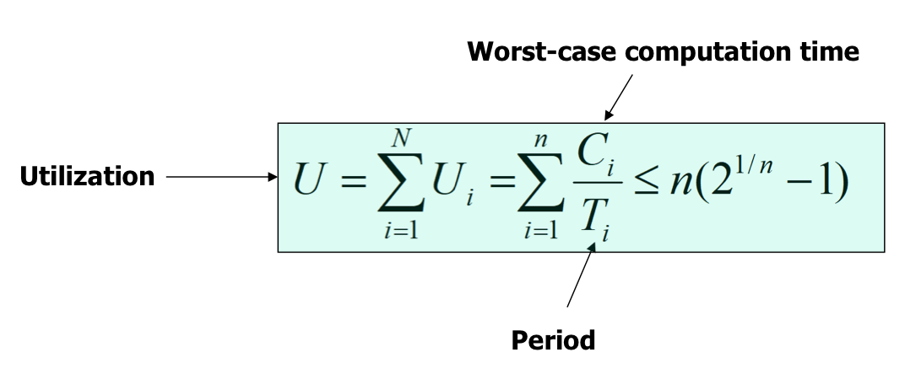
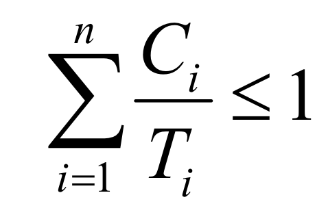

# Real Time Scheduling
* feasibility analysis
    - 데드라인 맞출 수 있을지 파악 가능
    - 설계 단게에서 모든 task들이 deadline 맞출 수 있는지 파악해야 함
* * *
## Rate Monotonic Scheduling(RMS)
* static priority 스케줄링 알고리즘
* 우선 순위가 변하지 않음
* 주기적인 task을 기준으로 설계
* 주기가 짧을 수록 높은 우선 순위
* **optimal** : 정적 우선 순위일 경우   

    

-> 충분 조건   
-> 이 식을 만족하지 않아도 데드라인 맞출 순 있음

## Earlist Deadline First(EDF)
* dinamic priority 스케줄링 알고리즘
* 우선 순위가 바뀔 수 있음
* 데드라인이 가까운 task일 수록 우선 순위가 높음
* 우선 순위는 task의 수행이 끝날 때마다 다시 계산됨

