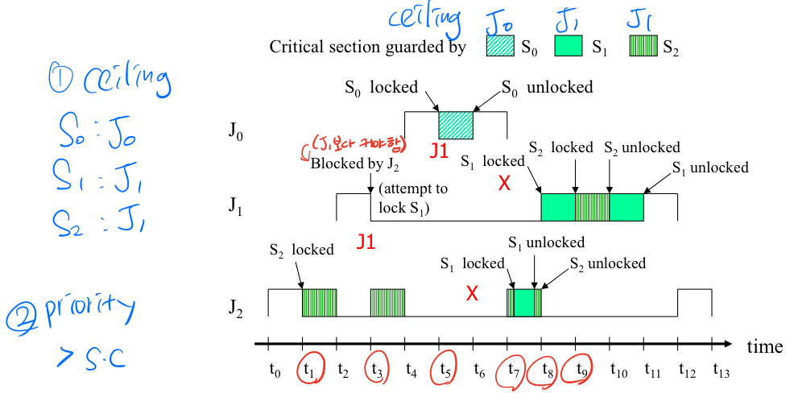
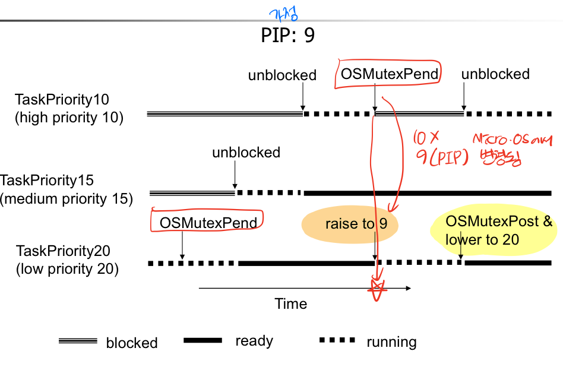
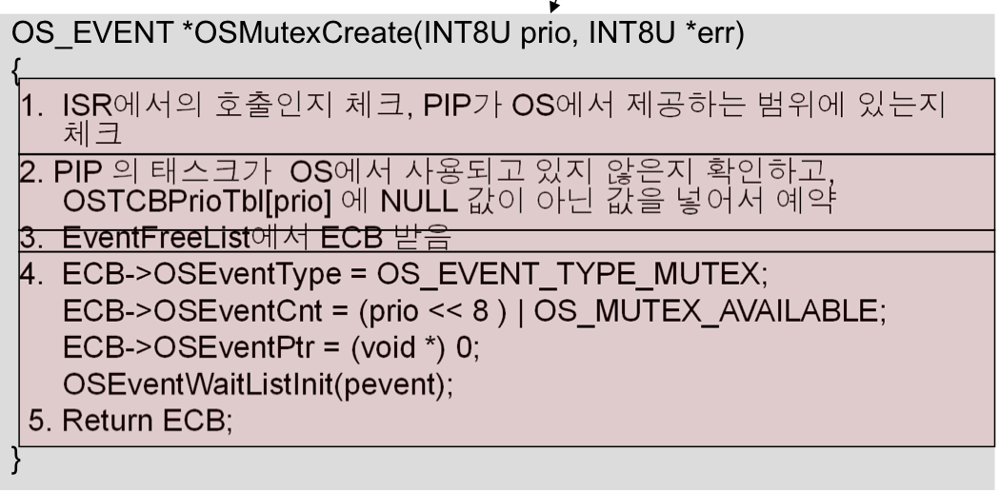
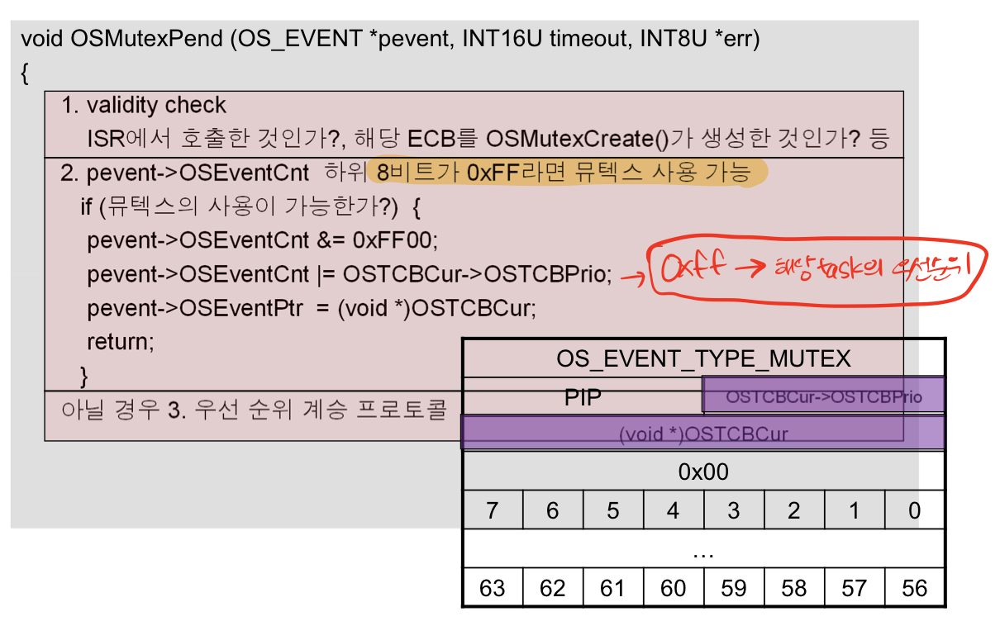
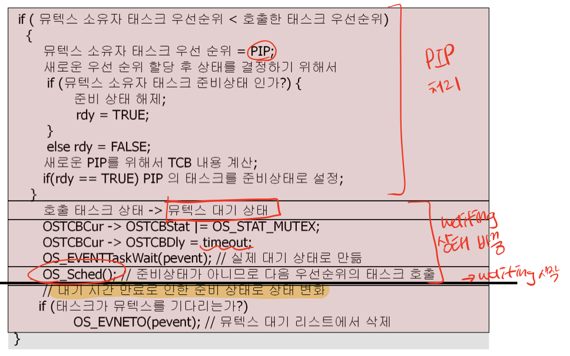
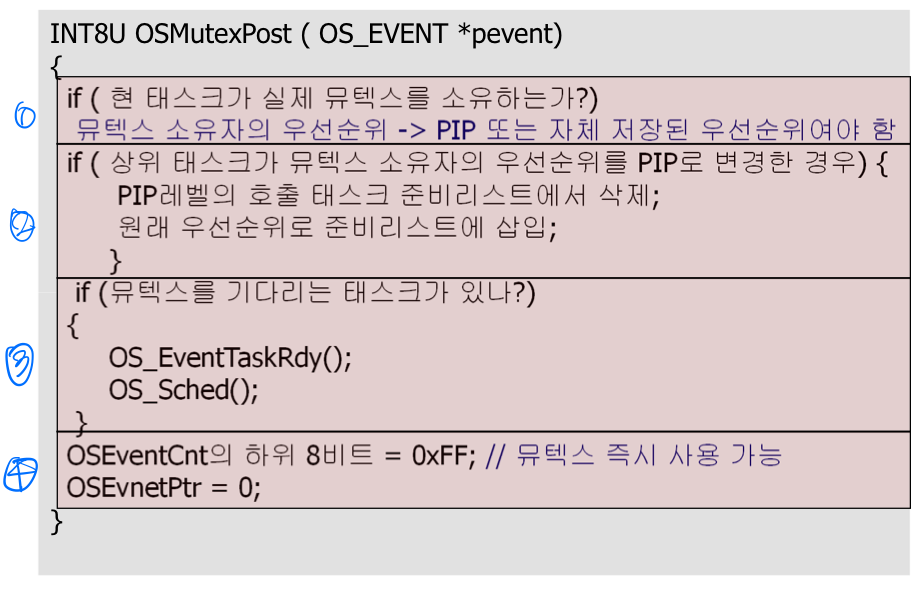

# Priority inversion
* 가정 : RMS   
* 언제 일어나나?
    1. 우선 순위 3이 낮은 task가 lock을 가져감
    2. 우선 순위 1이 lock을 가져가려고 대기함
    3. 우선 순위 2가 나타남
    4. preemption 발생하여 우선 순위3이 대기하고 우선 순위2가 실행됨
    5. 우선 순위 1은 무한 대기...

* * *
## Piority Inheritance Protocol(PIP)
공유 자원 변수를 우선 순위가 높은 태스크가 접근하려고 할 때 우선 순위가 낮은 태스크가 우선 순위가 높은 태스크의 우선 순위를 상속받는다.
1. 우선 순위가 언제 변하나?   
우선 순위가 높은 태스크가 대기하기 시작할 때
2. 언제 원래 우선 순위로 돌아오나?    
우선 순위가 낮은 태스크가 자원을 릴리즈할 때

* 문제 발생
    1. deadlock : 서로 lock해서 깨워줄 task가 없는 상황
    2. chained blocking : 연속해서 blocking 당하는 상황

* * *
## Priority Ceiling Protocol(PCP)
* Priority ceiling of a semaphore   
    - 해당 세마포어에 락을 건 task 중 가장 높은 우선 순위
    - 세마포어마다 각각 구함
* System Ceiling   
    - 다른 task에 의해 락이 걸린 모든 세마포어의 ceiling 중 최댓값
    - lock을 걸 때마다 구함

> **Priority > System Ceiling**

* 문제점 해결
    - deadlock
    - chained blocking
#### 참고 예시


* * *
## Mutex
PIP 방식이지만 높은 우선 순위 태스크의 우선 순위가 아닌, 쓰지 않는 우선 순위 중 높은 우선 순위를 상속받음


* 생성
    ```c++
    OS_EVENT *OSMutexCreate(INT8U prio, INT8U* err); // PIP로 사용할 priority
    ```
    
* Pend
    ```c++
    void *OSMutexPend(OS_EVENT* pevent, INT16U timeout, INT8U* err)
    ```
    
    
* Post
    ```c++
    INT8U OSMutexPost(OS_EVENT* pevent)
    ```
    