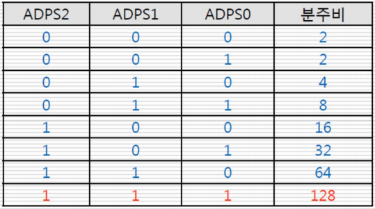

# Board
0. [개관](#0-개관)
1. [LED](#1-LED)
2. [FND](#2-FND)
3. [Switch](#3-Switch)
4. [Buzzer](#4-Buzzer)
5. [CDS(광센서)](#5-CDS(광센서))
6. [온도 센서(I2C)](#6-온도-센서(I2C))


* * *
## 0. 개관
### Atmega 128
- RISC(Reduced Instruction Set Computer) 구조
- 최대 16Mhz
- 113종 명령어 세트
- 32개의 8비트 범용 레지스터
- 128Kb의 ISP 방식의 프로그램용 플래시 메모리 장착
- 총 53개의 GPIO 포트 내장
- 8개의 외부 인터럽트를 포함한 34개의 인터럽트 벡터 내장

#### 메모리 구조
- 프로그램 메모리
    + 프로그램 코드 저장 및 실행
    + 16bit 64K 워드(총 128Kbyte) 플래시 메모리
    + Application flash Section : 프로그램 코드 저장 공간
    + Boot Flash Section : Boot Loader HEX코드를 저장하는 공간
- 데이터 메모리
    + 프로그램이 실행될 때 임시로 데이터를 저장하는 메모리
    + 범용 레지스터 : ALU 연산에 필요한 데이터들을 임시로 저장
    + 특수 기능 레지스터 : 칩의 I/O 제어나 상태보고 등의 특별 기능들을 수행

### GPIO
* 개요
    - 범용으로 사용되는 입출력 포트로 설계자가 입력과 출력을 마음대로 선택할 수 있음
    - 출력으로 사용시, 0과 1의 출력 신호를 임의로 만들어 줄 수 있는 구조를 가짐
    - 입력으로 사용할 대는 외부 인터럽트를 처리할 수 있도록 하는 기능이 있는 경우가 있음
* GPIO 레지스터
    - 3가지 : 입출력 방향 전환 레지스터, 출력용 레지스터, 입력용 데이터 레지스터
    - 내부적으로 pull-up 저항을 가지고 있는 경우가 많음
    - GPIO로 설정하는 경우가 만혹, 보통 다른 신호와 중복하여 사용
* Pull-up & Pull-down setting
    - input이 연결되지 않은 경우의 상태를 정의하기 위해서 입력 핀에서 사용된다.
    - 상태정의가 안된 input은 floating이라는 0이나 1이 아닌 입력 값이 될 수 있는 문제를 야기한다.
    - Input이 floating이 되게 해선 안된다.

#### Pull-up


|value|bit|
|---|---|
|off|1|
|on|0|

<br/>

#### Pull-down


|value|bit|
|---|---|
|off|0|
|on|1|

<br/>

### ATmega128 GPIO 관련 레지스터
1. DDRx : Data Direction Register
    - 각 포트에 대한 **데이터 입출력 방향 지정용 레지스터**
    - DDRA ~ DDRG 레지스터의 해당 비트에 1를 쓰면 출력(default), 0을 쓰면 입력으로 설정
2. PORTx : Port Output Register
    - 데이터 출력 레지스터
    - 출력을 원하는 데이터값을 PORTx 레지스터에 쓰면 됨
3. PINx : Port Input Register
    - 데이터 입력 레지스터
    - PINx 레지스터의 값 == 입력된 값
4. SFIOR : Special Function IO Register
    - SFIOR의 비트2 (PUD:Pull-Up Disable)을 1로 세팅하면 풀업 저항이 비활성화되고(default), 0으로 하면 활성화 됨

#### 시간 지연 함수
- AVR 개발 환경에서 제공하는 시간 지연용 함수들은 <delay.h>에 정의

```c++
#define F_CPU 16000000UL
#include <util/delay.h>

_delay_ms(unsigned int i)
_delay_ns(unsigned int i)
```

#### volatile
* 선언된 변수와 관련된 코드를 임의로 최적화하지 말라는 의미
* 언제?
    - ISR에서 변수를 사용하는 경우
    - 자동변수의 경우 일정시간 CPU에서 operation을 수행해 주기를 원하는 경우
    - 코드의 순서를 지키고 싶은 경우
    - I/O 레지스터 등을 메모리맵에 매핑시켜서 사용하는 경우

* 예시
    ```c++
    int a;

    a = 1;      // 이 코드는 컴파일러에 의해 무의미해짐
    a = 0;
    ```

#### Port
* 8비트 I/O 포트 6개 : PA, PB, PC, PD, PE, PF
* 5비트 I/O 포트 1개 : PG

|PORT|type|num|
|---|---|---|
|PA|LED|8|
|PB|Buzzer|
|PC|FND - segment|8|
|PD|
|PE|Switch|
|PF|
|PG|FND - position|4|


* * * 

## 1. LED
* 작동 원리
    1. DDRA 레지스터의 해당 비트에 1을 write하여 방향을 **출력 상태**로 만든다.
    2. PORTA 레지스터의 해당 비트에 1을 write한다.
        - 0 bit : LED0(LD8), 0b00000001, 1
        - 1 bit : LED1(LD7), 0b00000010, 2
        - ...
        - 7 bit : LED7(LD1), 0b10000000, 128

* 예시
    ```c++
    // 모든 LED 켜기
    #include <avr/io.h>
    int main() {
        DDRA = 0xff;    // 포트 A를 출력 포트로 사용
        PORTA = 0xff;   // 0xff = 0b11111111 -> LED 모두 ON
    }
    ```

* * * 

## 2. FND
* Flexible Numeric Device
* 7 segment LED

* 원리
    - 발광 다이오드
        + 양단에 전압 차를 가해 빛 방출
        + 2개의 다리 : 긴 쪽(+, 애노드), 짧은 쪽(-, 캐소드)
    - 애노드 : 공통단자를 Vcc에 연결, 입력 단자에 0V -> LED ON
    - 캐소드 : 공통단자를 GND에 연결, 입력 단자에 5V -> LED ON

* 세그먼트 숫자를 나타내는 부분의 신호는 모두 공유하고, sel 신호는 따로 존재

    

    - 동시에 오직 1개만 on할 수 있음
    - 짧은 시간에 빠르게 돌려가면서 켜면 모두 켜져있는 것처럼 보임

* 작동
    1. C 포트의 FND의 불을 켜기 위한 출력 포트로 설정한다.
    2. G 포트는 어떤 FND를 선택할 것인지 결정하는 선택 신호를 출력 포트로 설정한다.

    

* 예시
    ```c++
    #include <arv/io.h>
    #define F_CPU 16000000UL
    #include <util/delay.h>

    unsigned char digit[10] = {
        0x3f, 0x06, 0x5b, 0x4f, 0x66,
        0x6d, 0x7d, 0x27, 0x7f, 0x6f
    };
    unsigned char fnd_sel[4] = { 0x01, 0x02, 0x04, 0x08 };

    int main() {
        int i=0;
        DDRC = 0xff;
        DDRG = 0x0f;

        while(1) {
            for(i = 0;i<4;i++){
                PORTC = digit[4-i];
                PORTG = fnd_sel[i];
                _delay_ms(2.5);
            }
        }
    }
    ```

* * * 

## 3. Switch


* PE(PE4, PE5)에 할당
* 스위치가 눌려지지 않았을 때 1, 눌려졌을 때 0
* 인터럽트를 이용함

* 예시
    ```c++
    int main() {
        DDRA = 0xff;
        DDRE = 0x00;

        while(1) {
            if((PINE & 0x10) == 0x00)   // PE의 bit4가 1인가?
                PORTA = 0xff;       // LED on
            else
                PORTA = 0x00;       // LED off
        }
    }
    ```

#### 인터럽트
* 외부 인터럽트 트리거
    - edge trigger

        

        + 입력 신호가 변경되는 순간을 트리거로 사용
        + 하강 엣지 트리거 : 1 => 0 변경 시점
        + 상승 엣지 트리거 : 0 => 1 변경 시점

    - level trigger

        

        + 입력 신호가 일정 시간동안 원하는 레벨을 유지되면 트리거 사용
        + 평상시 1로 있다가 0으로 변환되어 일정 시간 유지되면 트리거 함

* 설정 과정
    1. 상태레지스터(SREG)에 있는 전체 인터럽트 **허용**비트(I bit)를 1로 세팅

        

        - ALU 연산 후 상태와 결과를 표시하는 레지스터

    2. 인터럽트 마스크 레지스터(EIMSK)에서 인터럽트 **가능** 비트 1로 세팅

        

        - 외부 인터럽트의 개별적인 허용 제어 레지스터
        - INTn이 1로 세팅되면 외부 인터럽트 활성화
        - bit4, 5가 Switch4, 5 임

    3. EICRA(External Intterupt Control Register) 세팅으로 level 및 edge 트리거 설정

        - EICRA : 외부 인터럽트 0~3의 트리거 설정에 사용

            


        - EICRB : 외부 인터럽트 4~7의 트리거 설정에 사용

            

    4. ISR 등록
        ```
        ISR(인터럽트이름) {     // INT4_vect, INT5_vect 등등
            인터럽트 서비스 루틴
        }
        ```

* 인터럽트 사용 예제
    ```c++
    volatile int
    
    ISR(INT4_vect) {
        count++;
        _delay_ms(100);
    }

    int main() {
        DDRE = 0xef;        // 0b11101111, PE4는 입력
        EICRB = 0x02;       // INT4 = falling edge
        EIMSK = 0x10;       // INT4 interrupt enable

        /* 같은 코드 */
        sei()
        SREG |= 1 << 7;     // SREG bit7 = I (Interrupt Enable)
        /***********/

        whie(1) display_fnd(count);
    }
    ```

* * *

## 4. Buzzer
* Passive Buzzer : Pulse의 주파수 형태에 따라 다른 소리 생성 가능
* PB에 할당
* 타이머와 인터럽트 이용함
* 버저 설계 개요
    - Passive Buzzer 사용하여 1개만 제공
    - 저전압(3.3V) 용으로 설계

#### 음을 울리려면?
|음계|도|레|미|파|솔|라|시|도|
|---|---|---|---|---|---|---|---|---|
|주파수|1046.6|1174.6|1318.6|1397.0|1568.0|1760.0|1795.6|2093.2|
|TCNT0|17|43|66|77|97|114|129|137|

* TCNT0 = 256 - (((1/주파수)*1000000)/2)/2

* 도의 경우에 1초에 1046.6번의 주파수가 요구되므로 1파형의 주기는 1/1046.6 = 955us   
    -> 따라서 478us 동안 1을 유지하고, 다시 477동안 0을 유지하면 됨

* 설정 과정
    1. Timer의 주기 설정(TCCRn)
    2. 정해진 시간 후 인터럽트 발생
    3. 인터럽트 핸들러에서 on/off 발생

#### timer/counter
* 4개의 타이머/카운터 보유
    - timer0, 2 : 8bit 타이머
        + 0~255까지 셀 수 있음
        + 10비트의 프리스케일러(prescaler) 보유
        + 2가지 인터럽트 기능 사용 가능(overflow, output comparision)
    - timer1, 3 : 16bit 타이머

* 인터럽트 기능
    - 오버플로우(Overflow) 인터럽트 : 카운터의 값이 오버플로우되는 경우에 발생, 8비트 타이머의 경우 값이 0xff에서 0x00으로 넘어갈 때 발생
    - 출려비교(Output Comparision) 인터럽트 : 카운터 값이 출력비교 레지스터의 값과 같게 되는 순간에 발생

* 프리스케일러(Prescaler)
    - 고속의 클럭을 사용하여 타이머를 동작시킬 때 나타나는 문제 해결
    - 클럭을 분주하여 더 느린 타이머 클럭을 생성

#### 8 bit 타이머 관련 레지스터
- Timer/Counter Control Register(TCCRn)

    

    + 타이머/카운터 제어 레지스터 n(n=0 or 2)
    + 동작 모드, 프리스케일러 등 타이머/카운터의 전반적인 동작 형태를 결정
    + CSn : 클럭 및 프리스케일러 선택

        


    
- Timer/Counter Register(TCNTn)
    + 타이머/카운터 레지스터 n(n=0 or 2)
    + 타이머/카운터 n의 8비트 카운터 값을 저장하고 있는 레지스터
    + Read/Write 가능
    + overflow 발생 시 레지스터의 값은 자동으로 0으로 클리어, 부주된 주기마다 1씩 증가

- Timer Interrupt Mask(TIMSK)

    

    + 타이머 인터럽트 마스크 레지스터
    + 타이머/카운터0, 타이머/카운터1, 타이머/카운터2가 발생하는 인터럽트를 개별적으로 Enable하는 레지스터
    + TOIE0 : 비트0, 타이머/카운터0의 Overflow Interrupt Enable
    + OCIE0 : 비트1, 타이머/카운터0의 Output Comparision Enable

* 예제
    1. Prescaler로 32분주를 선택하여 주기를 2u로 만든다.
    2. 478us/2us = 239클록을 카운팅해야 하므로 256-239=17값을 TCNT0에 Write한다.
    3. TIMSK의 TOIE0(Overflow Interrupt) 설정 및 전역 인터럽트 설정

    ```c++
    ISR(TIMER0_OVF_vect) {
        if(state = ON){
            PORTB = 0x00;
            state = OFF;
        } else {
            PORTB = 0x10;
            state = ON;
        }
        TCNT0 = DO;             // DO = 17
    }

    int main() {
        DDRB = 0x10;
        TCCR0 - 0x03;       // 32분주
        TIMSK = 0x01;       // overflow
        TCNT0 = DO;         // 17

        sei();

        while(1);
    }
    ```

* * *

## 5. CDS(광센서)
* 빛의 양에 따라 변하는 가변저항


* A/D 컨버터
    - 아날로그 신호를 컴퓨터가 읽을 수 있는 병렬 또는 직렬의 디지털 데이터로 변환

#### 컨버터 레지스터
1. ADC Multiplexer Selection Register(ADMUX)
    - A/D 컨버터 멀티플레서 선택 레지스터
    - ADC 모듈의 아날로그 입력 채널 선택
    - ADC 모듈의 기준 전압 선택
    - 변환 결과 레지스터의 데이터 저장형식 지정

    

    - bit6, 7 : Reference Selection Bit
        - 기준 전압 선택

        
    
    - bit 5 : ADC Left Adjust Result
        - 변환 결과 레지스터의 데이터 저장형식 지정

        
    
    - bit 4~0 : Analog Channel and Gain Selection
        - 아날로그 입력 채널 선택

        

2. ADC Control and Status Register(ADCSRA)
    - ADC 모듈의 동작 설정
    - ADC 모듈의 동작 상태 표시

        

        |bit|desc|
        |---|---|
        |7|AD converter 사용?|
        |6|AD start conversion 사용?|
        |5|conversion 지속적으로 수행?|
        |4|data 도착 여부 확인|
        |3|interrupt 활성화?|
        |2~0|프리스케일링|

    - bit 7 : ADC Enable
        - 1로 설정하면 ADC 모듈 enable
    - bit 6 : ADC Start Conversion
        - 1로 설정하면 AD 컨버터 변환 시작
        - ADEN이 1로 설정된 후 첫 번째 변환에 25개의 ADC 클록 주기 필요 -> 다음 부턴 13 클록 요구
        - AD 변환이 종료된 후 자동으로 0으로 변환
    - bit 5 : ADC Free Running Select
        - 1 : free running mode, 자동으로 AD 변환 실행
        - 0 : 단일 변환 모드, 사용자가 시작하면 한 번만 AD 변환을 실행
    - bit 4 : ADC Interrupt Flag
        - A/D 변환을 알리는 플래그
        - 1로 세팅되어 있으면 AD 변환이 완료된 것임
    - bit 3 : ADC Interrupt Enable
        - SREG 레지스터의 I비트가 1로 설정되어 있어야 함
        - A/D 변환 완료 인터럽트 허용
    - bit 2~0 : ADC Prescaler Select Bit
        - A/D 컨버터 프리스케일러 선택

        

3. AD Converter Data Register High/Low(ADCH, ADCL)
    - A/D 컨버터 데이터 레지스터
    - A/D 컨버터의 결과를 저장하는 레지스터
    - 변환결과가 10비트 양의 정수로 표시(0~1023) -> 8비트 두 개를 쪼개서 10bit만 사용
    - 기준전압에 대한 비율 상수를 의미
    - ADLAR = 0일 경우, 우정렬

        

    - ADLAR = 1일 경우, 좌정렬

        

* 조작 방법
    1. ADMUX, ADCSRA 설정
    2. ADCSRA, ADCH/L 설정

* 예제
    ```c++
    #include <arv/io.h>
    #definde CDS_VALUE 871

    void init_adc();
    unsigned short read_adc();
    void show_adc(unsigned short value);

    int main() {
        unsigned short value;
        DDRA = 0xff;
        inti_adc();

        while(1) {
            value = read_adc();
            show_adc(value);
        }
    }

    void init_adc() {
        ADMUX = 0x00;
        ADCSRA = 0x87;
    }

    unsigned short read_adc() {
        unsigned char adc_low, adc_high;
        unsigned short value;
        ADCSRA |= 0x40;

        while((ADCSRA&0x10) != 0x10);

        adc_low = ADCL;
        adc_high = ADCH;

        value = (adc_high << 8) | adc_low;

        return value;s
    }

    void show_adc(unsigned short value) {
        if(value< CDS_VALUE) PORTA = 0xff;
        else PORTA = 0x00;
    }
    ```

* * *

## 6. 온도 센서(I2C)
* TWI : Two Wire Interface
* SCL : Serial Clock, Master가 제공하는 클록
* SDA : Serial Data, Master와 Slave가 함께 사용하는 데이터
* Slave지정은 7비트 어드레스를 이용하며, 전체 Slave를 호출하는 기능(broadcasting)도 지원


* 기본 전송 포맷

    

    |SCL|SDA|desc|
    |---|---|---|
    |HIGH|↓|변환 시작|
    |HIGH|↑|변환 종료|
    |↓ or ↑|-|데이터 전송|

* 데이터 송수신 포맷

    

* 데이터 송수신 동작

    

    - Address Cycle + Data Cycle
    - Stop이 나타나기 전까지 하나의 master가 버스를 관장함

* 온도 센서 연결 설계

    

    - Slave Address는 7bit, 1001100 이 기본값

#### TWI 제어 레지스터
1. TWI Control Register(TWCR)

    

    - bit 7 : TWINT
        + TWI Interrupt Flag
        + TWI가 현재의 동작을 완료했으면 1로 세팅
        + 자동으로 clear되지 않음
        + 1인 동안 SCL이 0상태를 유지하므로 반드시 1로 write해야 함
    - bit 6 : TWEA
        + TWI Enable Acknowledge
        + 1 byte 데이터를 수신한 후 ACK 신호를 1로 발생
    - bit 5 : TWSTA
        + TWI Start Condition Bit
        + Start 조건 출력
        + 다시 clear 해야 함
    - bit 4 : TWSTO
        + TWI Stop Condition Bit
        + Stop 조건 출력
    - bit 2 : TWEN
        + TWI Enable
        + TWI 버스를 enable 시킴
    - bit 0 : TWIE
        + TWI Interrupt Enable
        + TWI 인터럽트가 발생하도록 허용
        + 1로 세팅되어 있으면 TWINT가 생성될 때 인터럽트 발생

    - 요약 하자면?
        + 시작(1010010) : TWINT, TWEN, TWSTA
        + 멈춤(1001010) : TWINT, TWEN, TWSTO
        + 수신(1100010) : TWINT, TWEN, TWEA
        + 전송(1000010) : TWINT, TWEN

2. TWI Status Register(TWSR)

    

    - bit 7~3 : TWSn
        + TWI Status
        + TWI 진행 상태 표시값
    - bit 1~0 : TWPSn
        - TWI Prescaler Bits
        - TWI 클록 계산에 사용되는 프리스케일러값 세팅
            |bit|분주|
            |---|---|
            |00|1분주|
            |01|4분주|
            |10|16분주|
            |11|64분주|
    

3. TWI Data Register(TWDR)

    

    - 송신모드에서 다음에 송신(write)할 Slave address 혹은 data 저장
    - 수신모드에서 수신된 바이트를 저장

* 동작 과정
    - Master 송신(Write)

        

        1. Start 전송 : TWCR 설정, 1010010
        2. 상태 체크 : TWSR -> TWSR & 0xF8 = 0x08
        3. TWDR = SLA + W 세팅
        4. SLA + W 전송 : TWCR 세팅, 1000010
        5. Acknowledge 체크 : TWSR -> TWSR & 0xF8 = 0x18
        6. TWDR에 데이터값 세팅 : TWDR -> TWDR = DATA
        7. 데이터 전송 : TWCR 세팅, 1000010
        8. Acknowledge 체크 : TWSR -> TWSR & 0xF8 = 0x28
        9. Stop 전송 : TWCR 설정, 1001010

    - Master 수신(Read)

        
        
        1. Start 전송 : TWCR 설정, 1010010
        2. 상태 체크 : TWSR -> TWSR & 0xF8 = 0x08
        3. TWDR = SLA + R 세팅
        4. SLA + R 전송 : TWCR 세팅, 1000010
        5. Acknowledge 체크 : TWSR -> TWSR & 0xF8 = 0x40
        7. 데이터 수신 : TWCR 세팅, 1100010
        8. 상태 체크 : TWSR -> TWSR & 0xFC = 0x50
        9. Stop 전송 : TWCR 설정, 1001010
    
#### aTS75 레지스터
1. Command Register

    

    + 내부의 다른 레지스터를 지정하기 위한 레지스터
    + 일종의 Indirect Address Register
    + 다른 레지스터에 접근하려면
        1. Command Register에 접근하고자 하는 레지스터에 해당되는 값 write
        2. 원하는 레지스터 Read/Write


2. Temperature Register
    + 2바이트로 온도값 표시

        
    
    + 온도와 디지털값과의 관계

        

        + -20.5 = 1101011 --sign--> 0010100 --2의보수--> 0010101 = -21   
            1000 --소수점아래--> 0.5   
            => -21 + 0.5 = -20.5

3. Configuration Register
    + 온도값 유효 비트 설정

        

        |bit|value|
        |---|---|
        |00|9|
        |01|10|
        |10|11|
        |11|12|


* Slave Address 설정
    - Slave Address = 1001(A2)(A1)(A0) 7bit
    - 1001은 고정
    - 여기선 1001100

