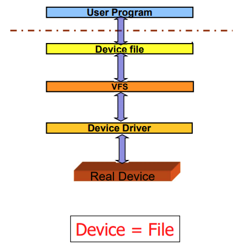
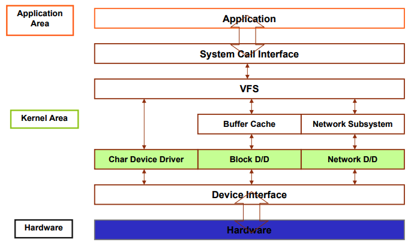

# 9 driver
1. [기본 개념](#1-기본-개념)
2. [Misc device driver](#2-Misc-device-driver)

* * *

## 1. 기본 개념
* 디바이스 드라이버
    * 디바이스 드라이버는 프로그램이다.
    * 하드웨어의 관리
    * 앱의 표준 인터페이스이다
    * 리눅스에서 커널 프로그램의 일부
    * **Dynamic module linking**
        - insmod : 커널에 모듈을 링크
        - rmmod : 모듈 제거

* Main design
    1. Mechanism
        + 어떤 기능이 제공되어야 하는지
    2. Policy
        + 그 기능이 어떻게 사용될 수 있는지
    * 디바이스 드라이버는 **policy-free**여야 한다
    * 하드웨어가 사용가능하게 하고, 나머지 어떻게 만들건지는 application에 달려있다.

* 계층구조

    

    * User Program에서 File API을 사용하여 디바이스에 open, read, write 함

* 분류

    

    1. Character devices
        - 일련의 흐름이 가능하다.
        - Terminal, Serial/Parallel, Keyboard, Sound Card, Scanner, Printer
        - No buffer cache
    2. Block devices
        - disk같은 host file system이다.
        - Floppy disk, hard disk, CD-ROM drivers
        - Mount command
    3. Network interfaces
        - 다른 호스트와 데이터 교환


* major number
    - driver 당 하나
    - `reguster_chrdev()` 함수를 이용하여 새 드라이버 추가
    
* minor number 
    - device 당 하나
    - 같은 종류의 디바이스는 하나의 driver를 쓴다.

* 지원 기능
    1. insmod : 커널에 모듈을 추가
    2. lsmod : 로드된 모듈의 정보 출력
    3. rmmod : 커널로부터 모듈 제거

* character device file 만들기
    ```
    $ mknod /dev/devce_name c device_name major_number minor_number
    $ mknod /dev/hello c 230 0
    ```

    * i-node 생성
    * i-node -> i_rdev <= major : 상위 8bit, minor: 하위 8bit
    * i-node -> i_fop <= device_fops


* init_module()
    - major number 부여
    - insmod -> init_module() -> register_chrdev()

    ```c++
    int register_chrdev(unsigned int major, const* name, struct file_operations* fops);
    ```

    |name|desc|
    |---|---|
    |major|0이면 자동으로 부여하여 return값으로 줌|
    |name|device name, /proc/devices 에 나옴|
    |**fops**|device와 연관된 file operation 포인터|

* 드라이버 삭제
    - rmmod -> cleanup_module() -> unregister_chrdev()
    ```c++
    void unregister_chrdev(unsigned int major, const* name);
    ```


* device_fops
    ```c
    struct file_operations device_fops = {
        open : device_open,
        read : device_read,
        write : device_write,
        ioctl : device_ioctl,
        release : device_release
    };
    ```

|name|func|desc|
|---|---|---|
|`owner`|struct module *owner|a pointer to a module that owns this structure|
|`llseek`|loff_t (*llseek) (struct file *, loff_t, int)|Change the current read/write position in a file|
|`read`|ssize_t (*read) (struct file *, char *, size_t, loff_t *)|Retrieve data from the device|
|`write`|ssize_t (*write) (struct file *, const char *, size_t,loff_t *)|Sends data to the device|
|`readdir`|int (*readdir) (struct file *, void *, filldir_t)|Not used for device drivers|
|`poll`|unsigned int (*poll) (struct file *,struct poll_table_struct *)|Inquire if a device is readable or writable or in some special state|
|`ioctl`|int (*ioctl)(struct inode *,struct file *,unsigned int, unsigned long)|Offers a way to issue device-specific commands (e.g. formatting a floppy disk)|
|`mmap`|int (*mmap) (struct file *, struct vm_area_struct *)|Request a mapping of device memory to a process’s address space|
|`open`|int (*open) (struct inode *, struct file *)|Open the device|
|`flush`|int (*flush) (struct file *)|only used for NFS|
|`release`|int (*release) (struct inode *, struct file *)|Close the device|
|`fsync`|int (*fsync) (struct file *, struct dentry *)|flush any pending data|

<br/>

### a simple device driver 
```c++
// kdriver.c
#include <linux/module.h>
#include <linux/fs.h>
#include <linux/kernel.h>
#include <linux/init.h>
#include <asm/uaccess.h>

static char device_name[20];
static int result; // holds the return value from register_chrdev
static int major_number=0; // holds major number

int test_open(struct inode *inode, struct file *file)
{
    printk("Open call for test device ₩n");
    return 0;
}

int test_release(struct inode *inode, struct file *file)
{
    printk("Release call for Char Device ₩n");
    return 0;
}

ssize_t test_read(struct file *file, char *buffer, size_t length, loff_t *offset)
{
    printk("Read Call for test device ₩n");
    return 0;
}

ssize_t test_write(struct file *file, const char *buffer, size_t length, loff_t *offset)
{
    char val;
    printk("Write Call for test device ₩n ");
    return 0;
}

// test_fops에 각 함수를 mapping 해준다.
struct file_operations test_fops = {
    open : test_open,       // open
    read : test_read,       // read
    write : test_write,     // write
    release : test_release, // release
};

int init_module(void)
{
    printk("TEST DEVICE DRIVER ₩n");
    strcpy(device_name, "TEST_Device");

    // test_fops의 주소를 넣어준다.
    result= register_chrdev(major_number, device_name, &test_fops);

    if(result<0) {
        printk("device: can get major number");
        return result;
    }
    if(major_number==0) major_number=result;
    printk("major_number:%d₩n",major_number);
    return 0;
}

void cleanup_module(void)
{
    printk("Clean Up Module₩n");
    unregister_chrdev(major_number,device_name);
}

MODULE_LICENSE("GPL");
MODULE_DESCRIPTION("dummy module");
MODULE_AUTHOR("EMBEDDED");
```

```c++
// kdriver_test.c

#include <stdio.h>
#include <fcntl.h>
#include <errno.h>

static int fd;

int main(int argc, char **argv){
    char buf[1];

    if((fd=open("/dev/test",O_RDWR))<=0){
        fprintf(stderr,"Open error: %s₩n",strerror(errno));
        return 0;
    }

    read(fd,buf,1);
    write(fd,buf,1);
    close(fd);
}
```

* * *

## 2. Misc device driver
* 레지스터의 작은 드라이버ㅔ게 모듈을 허용해주는 인터페이스
* List 형태로 존재
* 데이터 구조
    ```c
    struct miscdevice {
        int minor;      // misc device 구분을 위해
        const char* name;
        struct file_operations* fops;
        struct miscdevice *next, *prev;
    };
    ```

### simple misc driver
* 드라이버와 다르게 `register_chrdev()`, `unregister_chrdev()`, `init_module()`, `cleanup_module()` 없음
* 대신 `misc_register()`, `misc_deregister()`, `module_init()`, `module_exit()` 사용
* mknod도 사용하지 않음

```c
// kdriver.c
#include <linux/module.h>
#include <linux/kernel.h>
#include <linux/init.h>
#include <linux/fs.h>
#include <linux/miscdevice.h>
#include <linux/mutex.h>

static int kdriver_open(struct inode * inode, struct file * file){
    printk("kdriver_open, ₩n");
    return 0;
}

static int kdriver_release(struct inode * inode, struct file * file){
    printk("kdriver_release, ₩n");
    return 0;
}

static ssize_t kdriver_read(struct file * file, char * buf, size_t length, loff_t * ofs){
    printk("kdriver_read, ₩n");
    return 0;
}

static ssize_t kdriver_write(struct file * file, const char * buf, size_t length, loff_t * ofs){
    printk("kdriver_write, ₩n");
    return 0;
}

static long kdriver_ioctl(struct file * file, unsigned int cmd, unsigned long arg){
    printk("kdriver_ioctl,₩n");
    switch(cmd){
        default:
        return ENOTTY;
    }
    return 0;
}

static struct file_operations kdriver_fops = {
    .owner = THIS_MODULE,               // driver와 다른 점
    .open = kdriver_open,
    .release = kdriver_release,
    .read = kdriver_read,
    .write = kdriver_write,
    .unlocked_ioctl = kdriver_ioctl
};

static struct miscdevice kdriver_driver = {
    .minor = MISC_DYNAMIC_MINOR,
    .name = "kdriver",                  // 디바이스 파일은 /dev/ 디렉토리에 생성됨
    .fops = &kdriver_fops,
};

// 대신 misc_register() 사용
static int kdriver_init(void){
    printk("kdriver_init, ₩n");
    return misc_register(&kdriver_driver);
}

// 대신 misc_deregister() 사용
static void kdriver_exit(void){
    printk("kdriver_exit, ₩n");
    misc_deregister(&kdriver_driver);
}

module_init(kdriver_init);
module_exit(kdriver_exit);

MODULE_AUTHOR("Author of the kdriver to put it here.");
MODULE_DESCRIPTION("Description of the kdriver to put it here.");
MODULE_LICENSE("Dual BSD/GPL");
```

```c
// kdriver_test.c
#include <unistd.h>
#include <stdlib.h>
#include <stdio.h>
#include <fcntl.h>
#define NODE_NAME "/dev/kdriver"

int main(int argc, char * argv[]) {
    int fd;
    fd = open(NODE_NAME, O_WRONLY);

    if(fd < 0) {
        printf("%s open error...₩n", NODE_NAME);
        return -1;
    }

    write(fd, NULL, 0);
    ioctl(fd, 0, 0);
    close(fd);
    exit(0);
}
```
