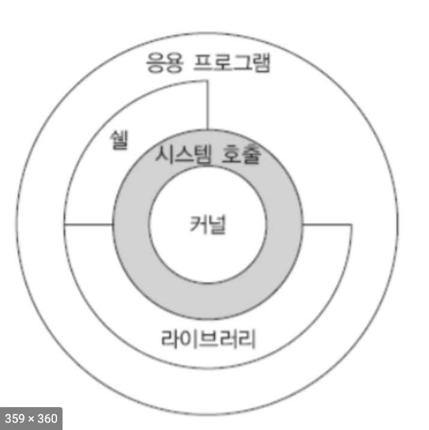

# CH1 기초 개념과 용어
1. [UNIX 구조](#1.-UNIX구조)
2. [Loggin In](#2.-Loggin-In)
3. [파일(File)과 디렉토리(Directory)](#3.-파일(File)과-디렉토리(Directory))
4. [파일 타입(File Types)](#4.-파일-타입(File-Types))
5. [소유자(Owner)](#5.-소유자(Owner))
6. [권한(Permissions)](#6.-권한(Permissions))
7. [프로세스(Process)](#7.-프로세스(Process))
8. [System call](#8.-System-call)
* * *
### Unix 대표 특징
* 대화형 시스템 : 유저가 명령을 내리면 시스템은 그 명령을 수행하고 결과를 출력
* 높은 이식성 : C언어로 구성이 되어 있기 때문에 타 기종에 이식이 유용
* 멀티 태스킹 시스템 : 동시에 여러 개의 프로세서 수행 가능
* 멀티 유저 시스템 : 여러 명의 사용자가 동시에 사용 가능
* 쉘 프로그래밍 : 반복적이고 복잡한 명령어를 대화식으로 처리 가능
* 계층적 파일 시스템 : 사용자가 그룹 간의 디렉토리 및 파일을 효과적으로 운용
* * *
## 1. UNIX 구조
      

유닉스는 크게 커널, 쉡, 유틸리티로 이루어져 있습니다.
1. 커널(Kernel)   
커널은 하드웨어와 OS사이의 인터페이스 역할을 하는 것으로 시스템 프로그램 계층입니다.   
커널에서는 기본적으로 네트워크, 프로세스 관리, 파일 관리, 장치 관리, 멀티태스킹 등의 기능을 제공합니다.
2. 쉘(Shell)   
3. 유틸리티(Utility)
shell에서 명령어 실행하게 되면 시스템 호출(system call)이 발생하여 kernel의 서비스를 받게 됩니다.
* * *
## 2. Loggin In
### Login Name
UNIX에 로그인을 하게 되면 로그인 이름과 비밀번호를 설정하게 됩니다.
### Shell
쉘은 command line interpreter 입니다. command line interpreter는 유저가 입력을 하게 되면 명령어를 실행하는 것입니다.      
한 번 로그인을 하게 되면 쉘(Shell)에 명령어를 입력할 수 있습니다.
* * *
## 3. 파일(File)과 디렉토리(Directory)
### 파일 시스템(File System)
* 유닉스의 파일 시스템은 파일과 디렉토리의 **계층 구조(hierarchical arrangement)**입니다.
* 파일과 디렉토리를 포함한 모든 것은 root 디렉토리(./)에서 시작합니다.
* 디렉토리 또한 디렉토리 엔트리를 가지고 있는 **파일**입니다.
### 파일 이름(File name)
* '/'와 '\0'는 파일 이름에 포함되면 안됩니다.
* 이 두 파일 이름은 자동적으로 생성됩니다.
    - `.` : 현재 디렉토리
    - `..` : 부모 디렉토리
### 경로(Path name)
```
/   
+-- usr   
|   +-- ben   
|   +-- keight   
|       +-- file1    
|       +-- file2   
```
* 절대 경로 : root에서부터 시작합니다.   
ex) /usr/keith/file1
* 상대 경로 : 현재 유저가 위치한 경로에서 시작합니다.   
ex) keith/file1
### Working Directory(현재 디렉토리)
* working directory는 현재 자신이 위치하고 작업을 수행 중인 디렉토리 입니다.
* 모든 프로세스는 working directory를 가지고 있습니다.
* 모두 상대 경로로 해석됩니다.   
```
$ pwd
/Documents/UNIX/Basic
```
### Home Directory
로그인을 하게 되면 홈 디렉토리(~)가 작업 디렉토리로 설정됩니다.
```
$ cd ~
```
### 파일 생성 개념
유닉스에서는 일반 파일 뿐만 아니라 주변 장치와 프로세스간 통신채널까지 모두 파일 취급합니다.
* 입출력 장치
    * `/dev/stdin/` : 키보드
    * `/div/stdout/` : 모니터
    * `dev/rmt0` : 저장 장치
* 프로세스 간 통신 채널(inter-process communication channerls)
    * FIFO
    * PIPE
    * SOCKET
* * *
## 4. 파일 타입(File Types)
|타입|비트|설명|
|---|---|---|
|Regular file|`-`|바이너리, 텍스트 파일|
|Directory file|`d`|디렉토리 파일|
|Character special file|`c`|터미널|
|Block special file|`b`|디스크|
|FIFO(pipe)|`p`|프로세스간 통신|
|Symbolic link|`l`|심볼릭링크|
|Socket||프로세스간 네트워크 통신|
* * *
## 5. 소유자(Owner)
* 각 파일은 특정 유저가 소유합니다.
* 소유자는 파일과 관련된 권한을 설정할 수 있습니다.
* * *
## 6. 권한(Permissions)
* 파일에 접근하고 사용할 수 있는 유저와 방식을 설정합니다.
* 소유자는 **파일의 속성을 변경할 수 있는 특정 권리**를 부여한다. 
* * *
## 7. 프로세스(Process)
실행되고 있는 프로그램의 인스턴스   
`ps` 명령어 : 프로세스 정보를 보여줌
* inter-process communication(IPC)
    - PIPE
    - FIFO
    - Signals
    - Shared memory
    - Semaphore
    - Sockets
* * *
## 8. System call
* 유닉스 커널로 들어가는 열쇠(?) 혹은 여권...
* 간접적으로   
    library routine -> system call -> kernel
    ```c
    nread = fread(inputbuf, OBJSIZE, numberobjs, fileptr);
    ```
    - 왜?   
        1. 사용자 친화적 인터페이스
        2. 시스템 효율(버퍼 만드는 방식의 차이)
* 직접적으로   
    system call -> kernel
    ```c
    nread = read(filedes, inputbuf, BUFSIZE);
    ```
    