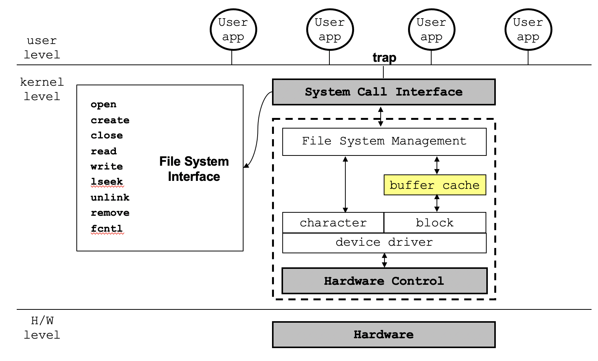
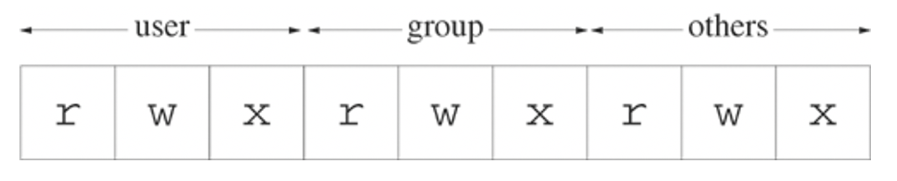

# CH2 파일(File)
## 1. 파일(File)
데이터를 위한 컨테이너
* 일련의 바이트 
* no format
* 디스크 파일에서 각 바이트는 개별적으로 주소로 접근 가능
* 외부 장치에 대해 균일한 인터페이스
### 파일 시스템(File System)
컴퓨터 파일과 데이터를 저장하고 체계화하는 방식
* 파일을 검색하고 접근하기 쉽다.
* 데이터 저장 장치에 사용된다(하드 디스크, CD-ROM).   

**파일 시스템에 접근하는 구조**   


## 2. UNIX file access primitevs
### UNIX primitives(유닉스 기본 요소)
|이름|설명|
|---|---|
|`open`|파일이 없으면 생성하고 파일을 열어 파일을 읽기, 쓰기|
|`create`|빈 파일 생성|
|`close`|연 파일 닫기|
|`read`|파일로부터 정보를 추출|
|`write`|파일의 정보를 입력|
|`lseek`|파일에서 읽고 쓰는 offset 변경|
|`unlink`|파일 삭제|
|`remove`|파일 삭제|
|`fcntl`|파일과 관련된 속성 제어|
* `fcntl`을 제외한 모든 함수는 **Unbufferd I/O**가 제공하고, file descriptor로 작동한다.
### File Descriptor
* 주민등록번호 같은 파일의 번호
* 양수   

커널에서 열러 있는 모든 파일은 file descriptor에 의해 참조된다.   
새 파일을 생성하거나 존재하는 파일을 열게 되면, 커널은 프로세스에게 file descriptor를 리턴한다.   
유닉스 쉘에 의해 생성된 각 프로세스는 터미널과 관련된 세 개의 파일과 함께 시작된다.
|file descriptor|symbolic constant|describe|
|---|---|---|
|0|STDIN_FILENO|Standard input(keyboard)|
|1|STDOUT_FILENO|Standard output(monitor)|
|2|STDERR_FILENO|Standard error|

* 0부터 2까지는 예약되어 있기 때문에 파일의 descriptor는 3부터 시작한다.
### `open()` system call
```c
int open(const char* pathname, int flags, mode_t mode);
```
* return   
    |||
    |---|---|
    |success|file descriptor|
    |error|-1|

* flags   
    `O_RDONLY | O_WRONLY == O_WRONLY` 이기 때문에 `O_RDWR` 있어야 함
    |**flags**|bit|desc|
    |---|---|---|
    |`O_RDONLY`|00|only 읽기|
    |`O_WRONLY`|01|only 쓰기|
    |`O_RDWR`|11|읽기와 쓰기|

* optional flag
    |**optional flags**|desc|
    |---|---|
    |`O_APPEND`|파일의 끝에서부터 이어 쓰기|
    |`O_CREAT`|파일이 없으면 생성한 후 쓰기, 존재하면 처음부터 덮어 쓰기|
    |`O_EXCL`|파일이 존재하면 에러|
    |`O_TRUNC`|파일이 존재하면 데이터를 삭제한 후 새로 쓰기|
    |`O_NONBLOCK`|blocking 없이 파일 열기|

* mode   
    `O_CREAT` flag일 경우에만 사용
    ```c
    // 예시
    fd = open('./file', O_WRONLY|O_CREAT, 0644);
    ```
### File permissions
9개의 bits로 표현   


|alphabet|binary bit|desc|
|---|---|---|
|r|100|읽기 권한|
|w|010|쓰기 권한|
|x|001|실행 권한|
