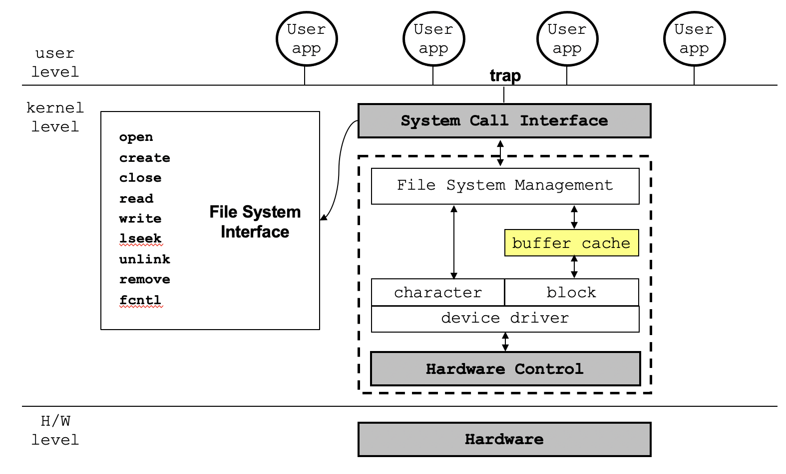
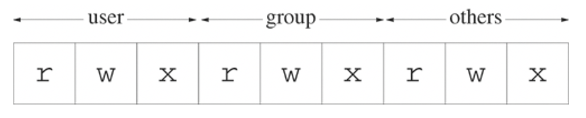
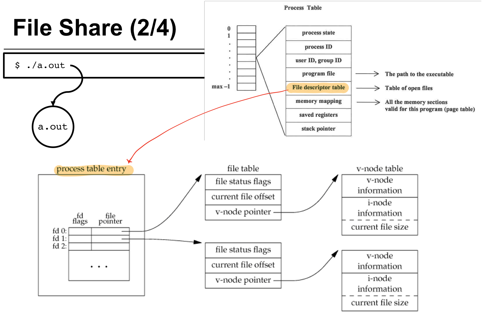
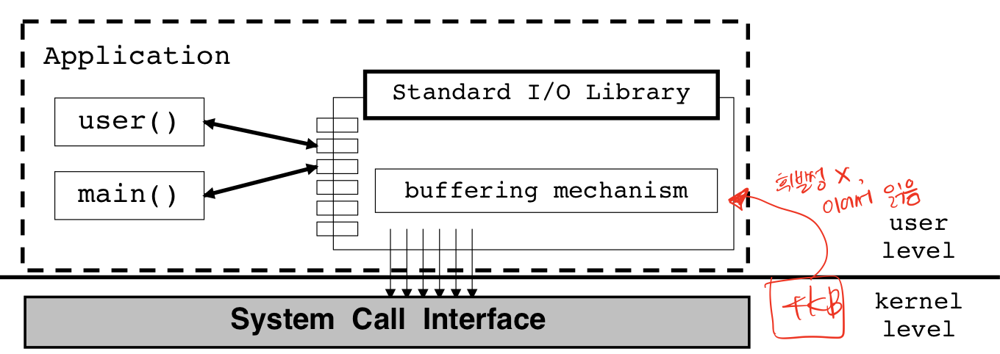
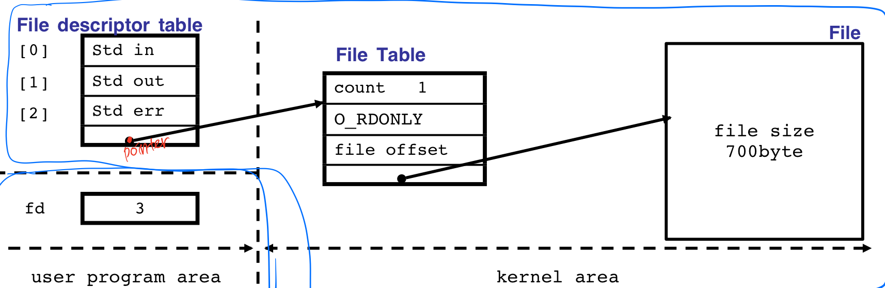
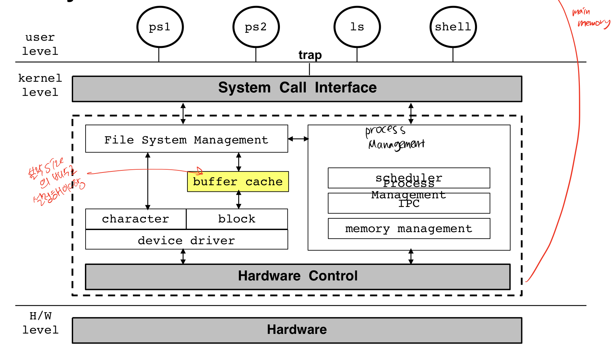
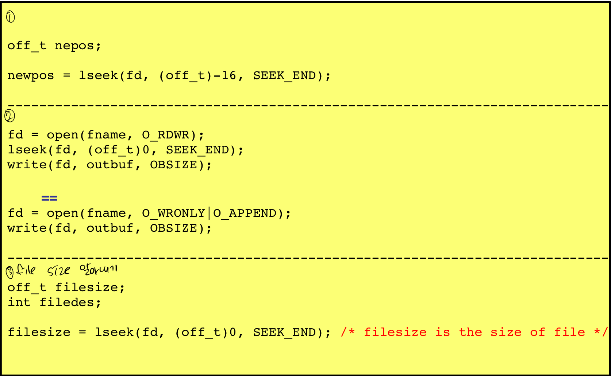
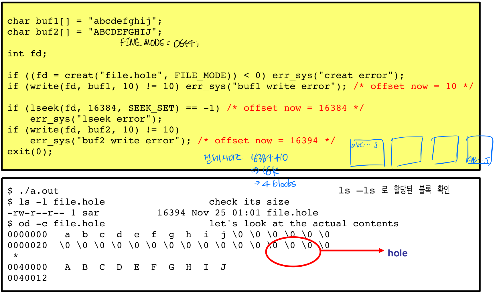

# CH2 파일(File) system call, standard I/O
1. [파일(File)](#1-파일(File))
2. [UNIX file access primitevs](#2-UNIX-file-access-primitevs)
3. [std input, std output, std error](#3-std-input,-std-output,-std-error)
4. [Std I/O library](#4-Std-IO-library)
5. [`errno` 변수](#5-errno-변수)
6. [System call](#System-call)
    * [`open()`](#open)
    * [`create()`](#create)
    * [`close()`](#close)
    * [`read()`](#read)
    * [`write()`](#write)
    * [`lseek()`](#lseek)
    * [`dup()` and `dup2()`](#dup-and-dup2)
    * [`fcntl()`](#fcntl)
7. [Standard I/O library](#Standard-IO-library)
* * *
## 1. 파일(File)
데이터를 위한 컨테이너
* 일련의 바이트 
* no format
* 디스크 파일에서 각 바이트는 개별적으로 주소로 접근 가능
* 외부 장치에 대해 균일한 인터페이스
### 파일 시스템(File System)
컴퓨터 파일과 데이터를 저장하고 체계화하는 방식
* 파일을 검색하고 접근하기 쉽다.
* 데이터 저장 장치에 사용된다(하드 디스크, CD-ROM).   

**파일 시스템에 접근하는 구조**   

* * *

## 2. UNIX file access primitevs
### UNIX primitives(유닉스 기본 요소)
|이름|설명|
|---|---|
|`open`|파일이 없으면 생성하고 파일을 열어 파일을 읽기, 쓰기|
|`create`|빈 파일 생성|
|`close`|연 파일 닫기|
|`read`|파일로부터 정보를 추출|
|`write`|파일의 정보를 입력|
|`lseek`|파일에서 읽고 쓰는 offset 변경|
|`unlink`|파일 삭제|
|`remove`|파일 삭제|
|`fcntl`|파일과 관련된 속성 제어|
* `fcntl`을 제외한 모든 함수는 **Unbufferd I/O**가 제공하고, file descriptor로 작동한다.
### File Descriptor
* 주민등록번호 같은 파일의 번호
* 양수   
* 커널에서 열러 있는 모든 파일은 `file descriptor`에 의해 참조된다.   
* 새 파일을 생성하거나 존재하는 파일을 열게 되면, 커널은 프로세스에게 file descriptor를 리턴한다.   
* 유닉스 쉘에 의해 생성된 각 프로세스는 터미널과 관련된 세 개의 파일과 함께 시작된다.

|file descriptor|symbolic constant|describe|
|---|---|---|
|0|STDIN_FILENO|Standard input(keyboard)|
|1|STDOUT_FILENO|Standard output(monitor)|
|2|STDERR_FILENO|Standard error|

* 0부터 2까지는 예약되어 있기 때문에 파일의 **descriptor는 3부터 시작한다.**
### File permissions
9개의 bits로 표현   


|alphabet|binary bit|desc|
|---|---|---|
|r|100|읽기 권한|
|w|010|쓰기 권한|
|x|001|실행 권한|

```c++
// 같은 코드
fd = creat("/tmp/newfile", 0644);
fd = open("/tmp/newfile", O_WRONLY|O_CREAT|O_TRUNC, 0644);
```
### Owner and permission of a new file
* `open` 혹은 `creat`으로 파일을 생성할 경우
    - 새로운 링크를 추가하는 것이기 때문에 상위 디렉토리의 쓰기 권한이 필요하다.
    - 디렉토리는 파일 리스트를 포함하는 하나의 파일일 뿐이다.
    - 디렉토리 안에 파일을 쓸 수 있는 권한이 필요하다.
* 누가 소유하나?
    - owner는 프로세스의 **effective user-ID**로부터 세팅된다.
    - group은 상위 디렉토리의 group-ID 혹은 effective group 중 하나로 세팅된다.

### File Share
* 모든 프로세스는 **process table** 안에 엔트리를 가지고 있다.
* 프로세스 테이블 엔트리는 open한 파일 descriptor의 테이블을 가지고 있다.



* process table entry   
    * index 0~2까지는 예약

    |name|desc|
    |---|---|
    |file descriptor flag|file 사용중이면 1, 아니면 0|
    |file table entry 포인터|file table을 가리키는 포인터|


    |index|name|
    |---|---|
    |0|std in|
    |1|std out|
    |2|std err|
    |3 ~ |file table entry pointer|file table을 가리키는 포인터|

* file table   
    |name|desc|
    |---|---|
    |file flag|file status flag|
    |offset|어디까지 읽고 썼는지 포지션 정보|
    |v-node 포인터|실제 파일의 v-node table을 가리키는 포인터|

* v-node table   
    |name|desc|
    |---|---|
    |v-node information|
    |i-node information|유니크한 정보, 파일이 몇 번째 block에 있나|
    |current file size|

* 프로세스마다 같은 파일의 다른 file table을 생성할 수 있지만, **v-node table은 파일마다 유니크하다.**
* * *

## 3. std input, std output, std error
### Redirection
1. 표준 입력 변경   
    ```
    $ prog_name < infile
    ```
    '<' 입력하게 되면 표준 입력 방식이 키보드에서 파일로 변경됨
    ```c++
    dup2(infile, 0);    // 0 : standard input -> keyboard
    ```
2. 표준 출력 변경   
    ```
    $ prog_name > outfile
    ```
    '>' 입력하게 되면 표준 출력 방식이 모니터에서 파일로 변경됨
    ```c++
    dup2(outfile, 1);   // 1 : standard output -> monitor
    ```
* * *

## 4. Std I/O library
* UNIX I/O (system call)
    * 간단한 바이트열 형식으로만 데이터를 다룬다.
    * 모든 것이 프로그래머에 의해 결정된다.
* Standard I/O
    - automatic buffering
    - 프로그래머 친화적 인터페이스
    - 라이브러리를 쉽게 사용하게 해줌
* std I/O와 UNIX I/O의 차이
    - 파일을 describe 하는 방법
    - std I/O는 `FILE*`
    - UNIX I/O는 file descriptor
* system call 함수에 f 붙이면 library routine   
    `fopen`, `fclose`, `fread`, `fwrite` 등...

### Buffering


* system call의 비효율성을 지양
* block 단위로 읽어와 버퍼에 저장한 후 다시 block을 읽고 버퍼에 저장하는 것(system call 방식)이 아닌, 버퍼에 저장 된 그 다음 바이트를 읽음
* * *

## 5. `errno` 변수
### 에러 핸들링
* 에러가 발생할 경우
    - -1이 리턴, 아닌 경우 0 리턴
    - errno.h에 errno 정의, 모두 E 로 시작함
    - 시스템 콜 중에 발생한 에러 중 마지막 타입을 errno에 저장
    - 전역으로 접근 가능한 integer 변수
    - **새로운 시스템 콜에서 에러가 없는 경우인데도, errno는 리셋되지 않음**
    - 에러발생 직후에는 errno를 초기화해줘야 함

* * *

## System call
### `open()`
```c
int open(const char* pathname, int flags, mode_t mode);
```

|status|return value|
|---|---|
|success|file descriptor|
|error|-1|

* flags   
    `O_RDONLY | O_WRONLY == O_WRONLY` 이기 때문에 `O_RDWR` 있어야 함
    |**flags**|bit|desc|
    |---|---|---|
    |`O_RDONLY`|00|only 읽기|
    |`O_WRONLY`|01|only 쓰기|
    |`O_RDWR`|11|읽기와 쓰기|

* optional flag
    |**optional flags**|desc|
    |---|---|
    |`O_APPEND`|파일의 끝에서부터 이어 쓰기|
    |`O_CREAT`|파일이 없으면 생성한 후 쓰기, 존재하면 처음부터 **덮어 쓰기**|
    |`O_EXCL`|파일이 존재하면 에러|
    |`O_TRUNC`|파일이 존재하면 **데이터를 삭제한 후 새로 쓰기**|
    |`O_NONBLOCK`|blocking 없이 파일 열기|

* mode   
    `O_CREAT`일 경우에만 사용
    ```c
    // 예시
    fd = open('./file', O_WRONLY|O_CREAT, 0644);
    ```

### `create()`
* 파일 생성의 다른 방법
* 파일이 이미 존재하면 두 번째 인자는 무시
* `open`과 다르게, file descriptor를 리턴하기 전에 존재하는 파일을 항상 삭제
* `creat`는 writing only로 파일을 오픈한다.
```c++
int creat(const char* pathname, mode_t mode);
```

|status|return value|
|---|---|
|success|file descriptor|
|error|-1|


### `close()`
* 오픈된 파일을 닫는다.
* 혼돈을 방지하기 위해, 모든 파일은 프로그램이 실행을 완료하게 되면 자동으로 닫힌다.   
    -> 프로세스 테이블 날아감
```c++
int close(int filedes);
```
|status|return value|
|---|---|
|success|0|
|error|-1|


### `read()`
* 파일을 읽으면 현재 파일 위치에서 메모리로 바이트가 복사된 후 파일 포지션이 업데이트된다.
```c++
ssize_t read(int filedes, void *buffer, size_t n);
```
|status|return value|
|---|---|
|success|number of bytes read|
|end of file|0|
|error|-1|

* arguments   
    |name|desc|
    |---|---|
    |filedes|file descriptor|
    |buffer|데이터가 복사될 구조체 혹은 포인터|
    |n|파일로부터 읽을 바이트의 수|



* file descriptor table에서 file table로 직접 접근 가능
* file table에서 file descriptor로 직접 접근 불가능하고 system call을 이용해서 간접접근만 가능
* parent-child 관계이면 file table 공유 가능 -> file table의 count르 올라감
* 같은 파일이라도 open할 때마다 file table 새로 생성

### `write()`
* 파일을 쓰면 메모리에서 현재 파일 위치로 바이트가 복사된 후 파일 포지션이 업데이트된다.
* 이미 존재하는 파일을 쓰기위해 오픈을 하게 되면, 파일은 덮어 써진다.
* `O_APPEND` 옵션을 이용하여 파일을 오픈하였을 경우, 파일의 오프셋은 현재 파일의 EOF이다.

```c++
ssize_t write(int filedes, const void* buffer, size_t n);
```
|status|return value|
|---|---|
|success|number of bytes written|
|error|-1|

* argument   
    |name|desc|
    |---|---|
    |filedes|file descriptor|
    |buffer|쓰여질 데이터가 있는 포인터|
    |n|쓰여질 바이트의 수|

#### `read`, `write` 효율성
* 버퍼 사이즈가 커지면 퍼포먼스가 개선된다.
    - 제일 좋은 퍼포먼스는 디스크 블락 단위의 버퍼일 때
* 시스템 콜은 프로그램과 커널의 모드를 바꾸는 것이기 때문에 상대적으로 비용이 많이 든다.
* ❓ `write` 시스템 콜이 빠른 이유   
    - `write` 을 호출할 때, 커널에 있는 버퍼 캐시에 데이터를 쓴 후 리턴한다.
    - 디스크에 에러가 있거나 커널이 멈춘 경우 데이터가 날아갈 수 있다.



### `lseek()`
* 파일의 offset은 `lseek` 호출로 세팅된다.
* offset 이란❓   
    - 다음 `read` 혹은 `write`가 어디서 시작해야 하는지 체크해놓은, 레귤러 파일의 위치이다.
```c++
off_t lseek(int filedes, off_t offset, int start_flag)
```
|status|return value|
|---|---|
|success|new file offset|
|error|-1|

* arguments
    |name|desc|
    |---|---|
    |filedes|file descriptor|
    |offset|`start_flag`로부터의 바이트 수|
    |start_flag|시작 위치|

    - start_flag
        |start_flag|bit|
        |---|---|
        |SEEK_SET|0|
        |SEEK_CUR|1|
        |SEEK_END|2|

* 사용 방법   
       
    1. 맨 끝에서부터 16바이트 앞
    2. 이어 쓰기(O_APPEND)
    3. file size 알아내기

* file hole   
       
    - 파일을 쓰다가 offset을 뒤로 옮기면 그 사이는 null로 채워진다.
    - 사이즈는 offset을 옮긴 후 쓴만큼 커진다.

### `dup()` and `dup2()`
* 존재하는 file descriptor를 복사한다.
* `dup()`은 새로운 descriptor가 생성
* `dup2()`는 기존 descriptor가 다른 descriptor로 변경

```c++
int dup(int filedes);
int dup2(int filedes, int filedes2);
```

|status|return value|
|---|---|
|success|new file descriptor|
|error|-1|

### `fcntl()`
* 이미 열려 있는 파일의 속성을 변경할 수 있다.

```c++
int fcntl(int filedes, int cmd, ...);
```

|status|return value|
|---|---|
|success|depends on cmd|
|error|-1|

* arguments   
    |name|desc|
    |---|---|
    |filedes|file descriptor|
    |cmd|cmd paramter 값|

* cmd parameter    
    |name|desc|
    |---|---|
    |F_DUPED|존재하는 descriptor을 복제|
    |F_GETFD , F_SETFD|descriptor flag를 get/set|
    |F_GETFL , F_SETFL|status flag를 get/set|
    |F_GETOWN , F_SETWON|비동기 I/O 소유자를 get/set|
    |F_GETLK , G_SETLK , G_SETLKW|레코드 lock을 get/set|


* * *

## Standard I/O library
### `fopen()`
```c++
FILE* fopen(const char* restrict pathname, const char* restrict type);
```

|status|return value|
|---|---|
|success|file pointer|
|error|-1|

* arguments   
    |name|desc|
    |---|---|
    |`r` `rb`|읽기|
    |`w` `wb`|파일이 없으면 생성하고 쓰기, 있으면 삭제하고 다시 쓰기|
    |`a` `ab`|파일이 없으면 생성하고 쓰기, 있으면 이어서 쓰기|
    |`r+` `r+b` `rb+`|읽기와 쓰기|
    |`w+` `w+b` `wb+`|파일이 없으면 생성하고 읽기와 쓰기, 있으면 삭제하고 읽기와 쓰기|
    |`a+` `a+b` `ab+`|파일이 없으면 생성하고 읽기와 쓰기, 있으면 이어서 읽기와 쓰기|

### `getc()`
```c++
int getc(FILE* istream);
```
|status|return value|
|---|---|
|success|next character|
|error|EOF or error|

### `putc()`
```c++
int putc(FILE* istream);
```
|status|return value|
|---|---|
|success|c|
|error|EOF|

### `fprintf()`
```c++
int fprintf(FILE* restrict fp, const char* restrict format, ...);
```
|status|return value|
|---|---|
|success|number of characters|
|error|-1|
