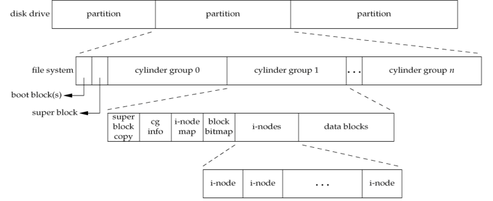

# CH3 파일(File) owndership, permission
1. [multi-user 환경](#1.-multi-user-환경)
2. [File with multiple names](#2.-File-with-multiple-names)
3. [파일 정보 : `stat`과 `fstat`](#3.-파일-정보-:-`stat`과-`fstat`)
4. [System call](#System-call)
    * [`umask()`](`umask()`)
    * [`access()`](`access()`)
    * [`chmod()`](`chmod()`)
    * [`chown()`](`chown()`)
    * [`link()`](`link()`)
    * [`unlink()`](`unlink()`)
    * [`rename()`](`rename()`)
    * [`symlink()`](`symlink()`)
    * [`readlink()`](`readlink()`)
    * [`stat()`](`stat()`)

* * *
## 1. multi-user 환경
### users and ownerships
* owner   
    - 유닉스 시스템의 모든 파일은 하나의 시스템 유저를 가지고 있다.
    - 소유자는 보통 파일을 생성한 유저
    - 소유자의 실제 identity는 **user-id(uid)**
    - uid : 특정 유저네임과 연관되어 있음
    - 유닉스 프로세스는 프로세스를 시작한 유저의 uid와 연관되어 있음
    - 파일이 생성될 때 시스템은 생성된 프로세스의 uid의 ownership을 생성한다.
    - ownership은 superuser(username=root, uid=0)와 file의 소유자를 변경할 수 있다.
* group
    - 각 유저는 적어도 하나의 그룹에 속해 있다.
    - 터미널에서 `id` 명령어를 실행했을 때 가장 먼저 나오는 그룹이 디폴트 그룹
    - `/etc/group`에 정의되어 있음
    - 그룹의 실제 identity는 **group-id(gid)**
    - gid : 특정 그룹이름과 연관되어 있음
* gid, uid는 유저가 시작한 프로세스로부터 상속된다.

### Effective user and group id
* **ruid(real user-id)**   
    - 프로세스를 시작한 유저의 uid
* **euid(effect user-id)**
    - 특정 작업을 수행하기 위한 프로세스의 권한을 평가한다.
    - 특정 작업을 수행하는 실제 권한자
* 대부분 ruid와 euid는 동일하다.
* euid와 egid는 파일 접근 권한을 결정한다.
* ownership
    - 파일과 관련된 권한을 선택할 수 있다.
    
### permission and file mode
* permission
    ```
    rwx     rwx     rwx
    usrer   group   others

    -rwxrwxrwx      -> 파일
    drwxrwxrwx      -> 디렉토리
    ```
    - 유저 형식
        + user
        + group
        + others
    - 파일 권한 형식
        + read
        + write
        + execute
    - superuser는 권한에 관계없이 파일에 접근 가능

|octal|symbol|user type|access type|
|---|---|---|---|
|04000|S_IRUID||uid에게 execution|
|02000|S_IWGID||gid에게 execution|
|01000|S_IXVTX||save-text-image|
|00400|S_IRUSR|owner|read|
|00200|S_IWUSR|owner|write|
|00100|S_IXUSR|owner|execute|
|00040|S_IRGRP|group|read|
|00020|S_IWGRP|group|write|
|00010|S_IXGRP|group|execute|
|00004|S_IROTH|other|read|
|00002|S_IWOTH|other|write|
|00001|S_IXOTH|other|execute|

### `open()` system call 과 파일 권한
* 이미 존재하는 파일을 `open()` 시스템 콜을 이용하여 open할 경우
    - 시스템은 파일의 권한을 체크하여 프로세스에서 요청한 접근 모드가 허용되지 않는지 확인한다.
    - 프로세스가 요구되는 접근 권한이 없을 때, -1를 리턴
    - **파일을 open하면, 커널은 euid와 eguid를 기반으로 접근 테스트를 수행한다.**
    - 다시 파일을 저장할 때 open할 때 넣었던 권한으로 업데이트

### 실행 파일의 추가적인 권한
- 일반적으로 파일이 실행 프로그램을 포함할 경우에만 관련이 있다.
- `S_ISUID` 권한이 세팅되어 있고 실행 프로그램이 실행되면, 시스템은 euid를 그 프로그램 파일의 소유자로 변경한다.
- 프로그램 소유자의 권한으로 프로그램을 실행(euid 변경)   
    원래는 프로그램을 실행한 유저가 euid
- S_IRUID, S_IWGID, S_IXVTX
- 권한에서 `s`로 표시
```
-rwsr-xr-x 1 user2 group2 ~~ a.out
```
#### password를 어떻게 바꿀 수 있나?
* `/etc/shadow`는 root만 read, write 가능
* `/etc/passwd`가 `-rwsr-xr-x`이기 때문에 root 권한으로 실행 가능   
    -> 패스워드 변경 가능

### 파일 생성 mask
- 파일을 생성하는 도중에 다른 유저의 접근을 막음
```c++
filedesc = open(pathname, O_CREAT, mode);
filedesc = open(pathname, O_CREAT, (~mask) & mode); // masked
```
mask : `000010010`


* * *

## 2. File with multiple names
### File system
* 파일 시스템은 저장 장치에 논리적 구조를 생성하는 소프트웨어 구성 요소이다.
* 계층 구조로 나타나며 파일과 폴더를 저장할 수 있다.
* 계층의 top은 보통 root 이다.
* mount-on
    - mount table & vfs list : 다른 OS 체계여도 unix file system 처럼 통함해줌

### UNIX File system


* Boot block
    - UNIX가 처음 활성화될 때 사용되는 boot code
* Super Block
    - 파일 시스템에서 블락의 전체 개수
    - i-node free list에 있는 i-node의 개수
    - free block의 bit map
    - block의 바이트 크기
    - free block의 개수
    - 사용되는 blockdml rotn
* i-nodes
    - 디스크에서 모든 i-node는 파일과 연관되어 있다.
    - 파일의 유니크한 정보
* data blocks
    - file block를 저장

### i-nodes 와 data block


* 각 파일은 하나의 i-node를 갖는다.
* 각 파일은 적어도 하나의 디렉토리로 링크되어 있어야 한다.
* i-node 0과 1은 사용되지 않는다.
    - 0 : no i-node(사용하고 있지 않다는 뜻)
    - 1 : bad disk block를 수집(사용 불가)
    - 2 : root directory(/)
    - 3 : 실질적으로 사용

### Hard link & Symbolic link
* **Hard link**   
    

    - 파일에 직접적으로 연결된 포인터
    - link count : i-node를 가리키고 있는 디렉토리 엔트리의 개수
    - link count가 0이 되어야 파일이 삭제될 수 있음
    - 같은 파일 시스템 내에 있어야만 가능
    - superuser만 디렉토리에 hard link를 생성할 수 있음
* **Symbol link**   
    

    - 파일에 간접적으로 연결된 포인터
    - 파일 시스템에 제한이 없음
    - symbol link의 실제 내용은 어디에 링크가 되어 있는지 이다.
    - 파일의 i-node를 저장하는 것이 아니라 **pathname**을 저장   
        -> 각 파일의 i-node는 다름


* doesn't follow : 심볼릭 링크를 따라가지 않고 그 파일 자체에 접근
* follow : 심볼릭 링크까지 따라가서 파일에 접근

* * *

## 3. 파일 정보 : `stat`과 `fstat`
[`stat()` system call](#`stat()`)   
[CH4_stat]()

* * *


## System call
### `umask()`
```c++
mode_t umask(mode_t cmask)
```
|status|return value|
|---|---|
|success|변경하기 전 파일 모드|

* 예시
    ```c++
    oldmask = umask(022);
    ```
    022 == ~(rwx-w--w-)   
    -> 소유자를 제외한 나머지는 읽기만 가능

### `access()`
* ruid와 rgid를 기반으로 pathname의 접근 권한 체크
```c++
int access(const char* pathname, int amode);
```
|status|return value|
|---|---|
|success|0|
|error|-1|

* arguments
    |name|desc|
    |---|---|
    |R_OK|읽기 권한 테스트|
    |W_OK|쓰기 권한 테스트|
    |X_OK|실행 권한 테스트|
    |F_OK|파일 존재 테스트|

### `chmod()`
* 파일의 소유자나 superuser가 파일 권한 변경 가능
```c++
int chmod(const char* pathname, mode_t newmode);
```
|status|return value|
|---|---|
|success|0|
|error|-1|

### `chown()`
* 파일의 uid와 gid를 변경
* 파일 권한을 변경하려는 illegal한 시도는 `EPERM` 에러 발생
* 파일의 소유권이 변경되면 set-user-id와 set-group-id는 꺼진다.

```c++
int chmod(const char* pathname, uid_t owner_id, gid_t group_id);
```
|status|return value|
|---|---|
|success|0|
|error|-1|

* arguments
    |name|desc|
    |---|---|
    |owner_id|새로운 owner|
    |group_id|새로운 group|

### `link()`
* 하드링크
* 새로운 디렉토리 엔트리를 생성하고 link count를 증가시킨다.
* 디렉토리의 hard link 생성은 superuser만 가능하다.
```c++
int link(const char* original_path, const char* new_path);
```
|status|return value|
|---|---|
|success|0|
|error|-1|

* arguments
    |name|desc|
    |---|---|
    |original_path|링크당할 파일 경로|
    |new_path|새로운 파일 경로|

### `unlink()`
* 존재하는 디렉토리 엔트리를 제거
* 링크된 이름만 제거를 하고 link count를 1 감소
* link count가 0이 되면, disk block이 free block list로 추가됨
* 파일이 존재하는 디렉토리의 **'w'** 권한이 있어야 함
* UNIX 아닐 경우 `remove()` 사용

```c++
int unlink(const char* pathname);
```
|status|return value|
|---|---|
|success|0|
|error|-1|

### `rename()`
* 이름 바꾸기
* 디렉토리와 symbolic link도 변경 가능
```c++
int rename(const char* oldname, const char* newname);
```
|status|return value|
|---|---|
|success|0|
|error|-1|

### `symlink()`
* symbolic link 파일이 open되었을 때도 realname으로 follow함
* symname을 보고 싶을 땐 `readlink()`를 사용
```c++
int symlink(const char* realname, const char* symname);
```
|status|return value|
|---|---|
|success|0|
|error|-1|

### `readlink()`
1. open sympath
2. 파일의 내용을 버퍼로 읽음
3. close sympath
* 원본 파일이 삭제될 경우, symbolic link를 볼 수는 있지만 `open`할 경우 `EEXIST` 에러가 발생
```c++
ssize_t readlinke(const char* sympath, char* buffer, size_t bufsize);
```
|status|return value|
|---|---|
|success|읽은 바이트의 개수|
|error|-1|

### `stat()`
```c++
#include <sys/stat.h>

int stat(const char* pathname, struct stat* buf)    // 파일의 정보
int fstat(int filedes, struct stat* buf);           // 파일 시스템의 정보
int lstat(const char* pathname, struct stat* buf);  // symbolic link 정보
```
|status|return value|
|---|---|
|success|0|
|error|-1|

* arguments   
    
