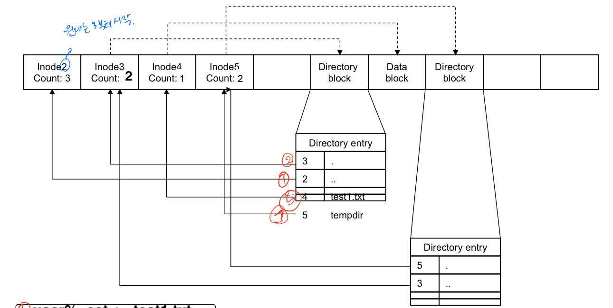
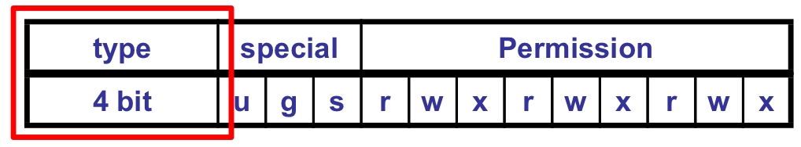

# CH4 Directory
1. [The implementation of a directory](#1-The-implementation-of-a-directory)
2. [디렉토리 프로그래밍](#2-디렉토리-프로그래밍)
3. [UINIX file system](#3-UINIX-file-system)
4. [System call](#System-call)
    * [`mkdir()`](#mkdir)
    * [`rmdir()`](#rmdir)
    * [`opendir()`](#opendir)
    * [`closedir()`](#closedir)
    * [`readdir()`](#readdir)
    * [`rewinddir()`](#rewinddir)
    * [`chdir()`](#chdir)
    * [`getcwd()`](#getcwd)
    * [`ftw()`](#ftw)
    * [`sync()`](#sync)
    * [`fsync()`](#fsync)

* * *
## 1. The implementation of a directory


### Directory
    - 디렉토리 엔트리를 포함하고 있음
    - `creat`이나 `open` 시스템 콜로 생성될 수 없음
    - `mkdir` 이나 `opendir` 사용
    - kernel만 write 할 수 있음
    - 디렉토리 엔트리의 시리즈로 구성되어 있어서, 서브디렉토리나 파일을 포함할 수 있음
    - symbolic link로 디렉토리 생성 가능
    - directory entry   
        |name|desc|
        |---|---|
        |i-node number|i-node|
        |character filed|directory 이름|

### Directory permission
* 일반적인 파일과 같게 구성됨

|permission type|interpreted|
|---|---|
|read|파일과 하위디렉토리 이름의 리스트|
|write|파일 생성 및 삭제|
|execute|하위 디렉토리로 이동, `chdir` 시스템 콜|

#### save-text-image(sticky bit)
* 공유 디렉토리에서 남이 만든 파일을 삭제하지 못하게 할 경우에 사용
* 이 경우에만 삭제 가능
    - 파일의 소유자
    - 디렉토리의 소유자
    - superuser
* 't'로 권한 나타냄   

    ```
    drwxrwxrwt
    ```

* * *
## 2. 디렉토리 프로그래밍
### `dirent` 구조체

```c++
#include <dirent.h>

struct dirent {
    ino_t d_ino;                // i-node number
    char d_name[NAME_MAX+1];    // filename
}
```

### struct `stat`


* 총 16개 비트  
* `st_mode`   
    |type|desc|
    |---|---|
    |S_IFBLK|block special|
    |S_IFCHR|character special|
    |S_IFIFO|FIFO special|
    |S_IFREG|regular|
    |S_IFDIR|directory|
    |S_IFLNK|symbolic link|
    |S_IFSOCK|socket|

* * *
## 3. UINIX file system
### `sync`와 `fsync` 캐싱
* 메모리에서 디스크로 쓰는 것이 바로 실행되지는 않는다.
* 읽기 또한 캐시 내에서 버퍼링된다.
* [`sync()`](#`sync()`)와 [`fsync()`](#`fsync()`) 사용하여 버퍼 데이터를 디스크에 쓴다.

* * *
## 4. UNIX device file
### Device of UNIX
* 할당되는 device number로 디바이스에 접근할 수 있다.
* device number를 device file로 mapping

* device number   
    |name|desc|
    |---|---|
    |major-number|device driver, the type of device, device file의 i-node 저장|
    |minor-number|the instance of specific device|

* device file
    - device file의 i-node는 device number를 포함한다.
    - 주변 장치에 대한 간단한 인터페이스를 제공
    - file system처럼 보임
    - 유저는 standard system call을 이용하여 device에 접근한다.
    - device는 regular file처럼 취급한다.
    - superuser에 의해 생성된다.

### UNIX device files
* 주변 장치
    - 파일 시스템에서 filename으로 접근 가능
    - disk, terminal, printer ...
* 일반적인 disk files와 다르게, device file에 읽고 쓰는 것은 시스템과 적절한 주변 장치 간에 직접적으로 데이터가 전송되게 할 수 있다.
    - 보통 `/dev` 이다.
    - /dev/tty00, /dev/rmt0, ...
* device file은 커맨드 레벨이나 프로그램에서 regular file처럼 사용된다.

### Block and character device files
* **Block device file**
    - disk, magnetic tape, random access

* **Character device file**
    - terminal, modem, printer, random access
* 2개의 운영 체제 구성 테이블
    - block device switch table : bdevsw[]
    - character device switch table : cdevsw[]
    - major-number를 테이블의 인덱스로 사용
* 주변 장치와의 데이터 전송 순서
    1. `read` 혹은 `write` 시스템 콜이 device file의 i-node에 접근
    2. 시스템은 i-node 구조체 내의 flag를 이용하여 디바이스가 block 혹은 character device인지 체크   
        major-number도 추출
    3. major-number는 device configuration table을 인덱싱하는 데 사용되고 device driver routine는 데이터 전송을 위해 호출된다.
* minor-number도 i-node에 저장되며, 둘 이상의 주변 포트를 지원하는 장치에서 접근되고 있는 포트를 정확히 식별하기 위해 device driver routines으로 전달된다.

### `stat` structure
* filename과 i-node를 포함하는 파일 시스템의 device number

|type|name|desc|
|---|---|---|
|mode_t|**st_mode**|**file type과 mode(permission)**|
|ino_t|st_ino|i-node number(serial number)|
|dev_t|st_dev|device number(file system)|
|dev_t|**st_rdev**|**device number for special files**|
|nlink_t|st_nlink|number of linkes|
|uid_t|st_uid|user id of owner|
|gid_t|st_gid|group id of owner|
|off_t|st_size|size in bytes, for regular files|
|time_t|st_atime|time of last access|
|time_t|st_mtime|time of last modification|
|time_t|st_ctime|time of last file status change|
|blksize_t|st_blksize|best I/O block size|
|blkcnt_t|st_blocks|number of disk blocks allocated|

#### st_mode
* 타입 체크 매크로   
    |macro|type of file|
    |---|---|
    |S_ISREG()|regular file|
    |S_ISDIR()|directory file|
    |S_ISCHR()|character special file|
    |S_ISBLK()|block special file|
    |S_ISFIFO()|pipe or FIFO|
    |S_ISLNK()|symbolic link|

    - 예시

        ```c++
        if(S_ISCHR(buf.st_mode))
            printf("It's character device");
        else
            printf("It's not");
        ```

#### st_rdev
* 실제 장치 파일에 연결된 장치번호
* 장치 파일의 고유 번호
* device file만 가지고 있음   
    character special file, block special file
* `major` , `minor` 매크로 사용(<sys/types.h>)  
 
    ```c++
    major(buf.st_rdev);
    minor(buf.st_rdev);
    ```

#### st_dev
* 장치 파일이 어떤 장치에 있는지 표시
* 보통 파일은 하드 디스크에 있으므로 하드 디스크의 장치 번호와 같음

### File System information

```c++
int fstatvfs(int filedes, struct statvfs* buf);
int statvfs(const char* path, struct statvfs* buf);
```

|status|return value|
|---|---|
|success|0|
|error|-1|

* statvfs
    |type|name|desc|
    |---|---|---|
    |unsigned long|**f_bsize**|**file system block size**|
    |unsigned long|**f_frsize**|**fundamental file system block size**|
    |fsblkcnt_t|f_blocks|total number of blocks on file system in units of f_frsize|
    |fsblkcnt_t|f_bfree|total number of free blocks|
    |fsblkcnt_t|f_bavail|number of free blocks available to non-privileges process|
    |fsblkcnt_t|f_files|total number of file serial numbers(#i-nodes)|
    |fsblkcnt_t|f_ffree|total number of free file serial numbers|
    |fsblkcnt_t|f_favail|number of file serial numbers available to non-privileges process|
    |unsigned long|f_fsid|file system ID|
    |unsigned long|**f_flag**|**bit mask of f_flag values**|
    |unsigned long|f_namemax|maximum filename length|

* f_flag
    |flag|desc|
    |---|---|
    |ST_RDONLY|read-only access로 마운트|
    |ST_NOSUID|estuid/setgid semantics 지원 안함|
    |ST_CHOWN_RESTRICTED|소유자 또는 기본 그룹을 적절한 권한을 가진 프로세스로 변경하는 것을 제한|
    |ST_THERAD_SAGE|thread-safe API는 이 파일 시스템의 객체에서 스레드 세이프 방식으로 작동|
    |ST_DYNAMIC_MOUNT|동적으로 마운트하고 마운트 해제|
    |ST_NO_MOUNT_OVER|위로 mount 되는 것 제한|
    |ST_NO_EXPORTS|해당 개체를 NFS(네트워크 파일 시스템) 서버로 내보낼 수 없음|
    |ST_SYNCHRONOUS|NFS 버전 2의 "synchronous write" 의미를 지원한다|
    |ST_CASE_SENSITIVE|대소문자 구분|

* f_bsize
    - 파일 시스템 블락 크기(바이트)
    - disk unit storage의 block에 있는 바이트 수
* f_frsize
    - 디스크 주소가 계산되는 단위

* * *
## System call
### `mkdir()`
* 해당 폴더에 execute 권한이 있어야 이동도할 수 있고 안에 있는 파일 실행 가능

```c++
int mkdir(const char* pathname, mode_t mode);
```

|status|return value|
|---|---|
|success|0|
|error|-1|

### `rmdir()`
* 빈 디렉토리 삭제
* 빈 디렉토리는 '.'와 '..'만 포함하고 있음

```c++
int rmdir(const char* pathname);
```

|status|return value|
|---|---|
|success|0|
|error|-1|

### `opendir()`
* `DIR`은 standard I/O library에서 `FILE`과 유사하게 실행
* pointer를 적절하게 null checking 해야 함
* 프로그램이 디렉토리를 접근하는 것을 완료하면 `closedir()`로 인해 close된다.

```c++
DIR* opendir(const char* dirname);
```

|status|return value|
|---|---|
|success|pointer|
|error|NULL|

### `closedir()`
* dirptr가 가리키는 디렉토리 스트림을 close한다.

```c++
int closedir(DIR* dirptr);
```

|status|return value|
|---|---|
|success|0|
|error|-1|

### `readdir()`
* 첫 번째 디렉토리가 dirent 구조체로 리턴
* 완료되면 다음 디렉토리 엔트리로 이동

```c++
struct dirent* readdir(DIR* dp);
```

|status|return value|
|---|---|
|success|pointer|
|error|NULL|

### `rewinddir()`
* `rewinddir()`를 호출할 경우 `readdir()`가 호출될 때 다음 디렉토리는 첫 번째 디렉토리가 됨

```c++
void rewinddir(DIR* dp);
```

|status|return value|
|---|---|
|success|0|
|error|-1|

### `chdir()`
* `chdir`을 만드는 **프로세스에서만** 적용됨
* path가 invalid 하거나 디렉토리에 execute 권한이 없을 경우 에러 발생
* 디렉토리를 변경하거나 새로운 디렉토리의 파일 이름을 사용할 때 `chdir()`를 호출하면 더 효율적임

```c++
int chdir(const char* path);
```

|status|return value|
|---|---|
|success|0|
|error|-1|

### `getcwd()`
* 현재 디렉토리 이름이 리턴되어서 name에 복사

```c++
char* getcwd(char* name, size_t size);
```

|status|return value|
|---|---|
|success|name|
|error|NULL|

### `ftw()`
* directory tree walk
* 모든 디렉토리를 탐색하며 `func()` 실행
* `func()`가 0을 반환하지 않거나, tree의 bottom에 도달하면 탐색 종료

```c++
int ftw(const char* path, int (*func)(), int depth);

int func(const char* name, const struct stat* sptr, int type){
    // definition
}
```

|status|return value|
|---|---|
|success|0|
|error|-1|

* `ftw` argument   
    |name|desc|
    |---|---|
    |path|디렉토리 이름|
    |depth|directory tree의 깊이|
    |func|탐색하면서 실행할 함수|

* `func` argument   
    |name|desc|
    |---|---|
    |name|객체 이름|
    |sptr|객체와 관련된 `stat` 구조체|
    |type|<ftw.h>에 정의된 상수|

    - type   
        |name|contents|
        |---|---|
        |FTW_F|File|
        |FTW_D|Directory|
        |FTW_DNR|읽을 수 없는 디렉토리|
        |FTW_SL|심볼릭 링크|
        |FTW_NS|심볼릭 링크가 아니고 `stat`이 실행할 수 없는 파일|

### `sync()`
* nonblocking wait
* return 될 때까지 기다리지 않음

```c++
void sync(void);
```

### `fsync()`
* blocking wait
* file을 디스크에 쓰는 것을 완료할 때까지 return 되지 않음

```c++
int fsync(int filedes)
```

|status|return value|
|---|---|
|success|0|
|error|-1|

