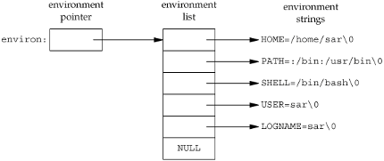
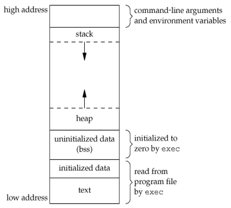
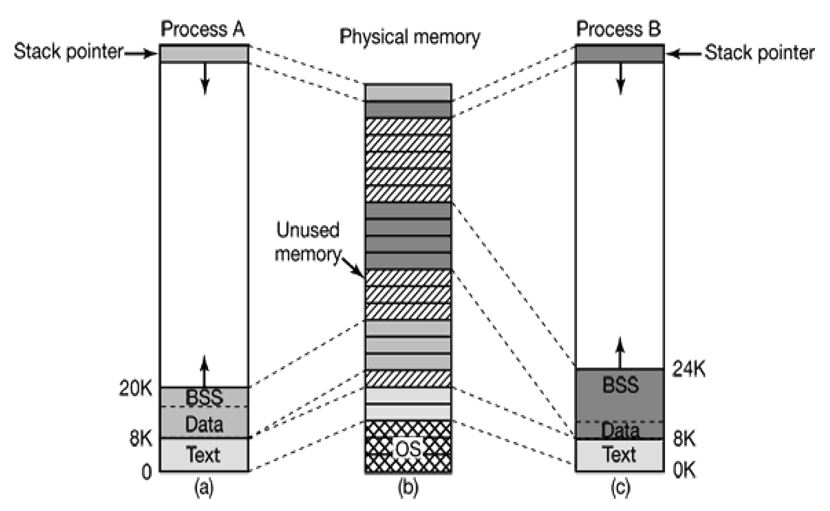
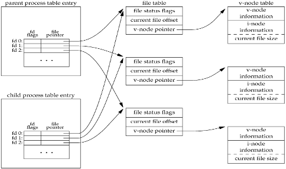
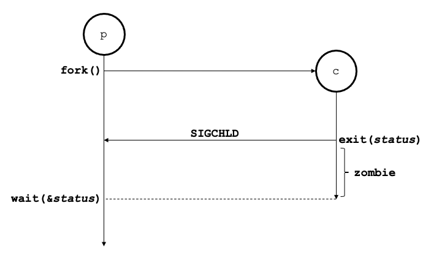
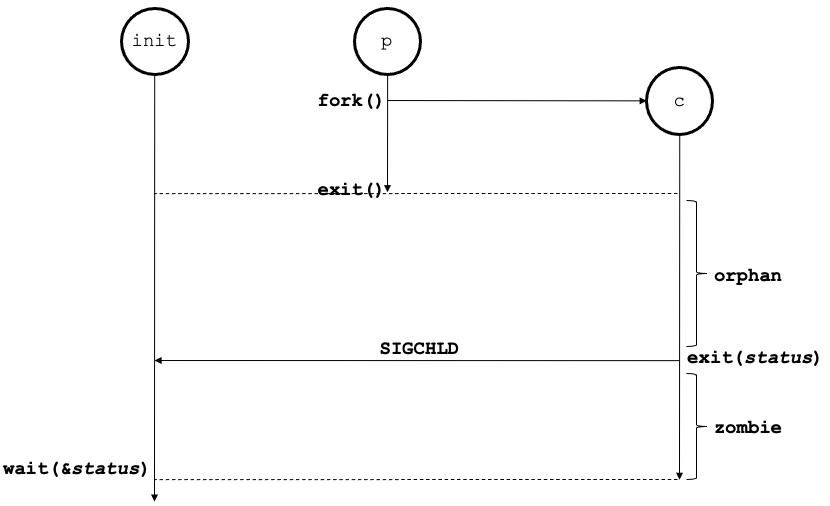
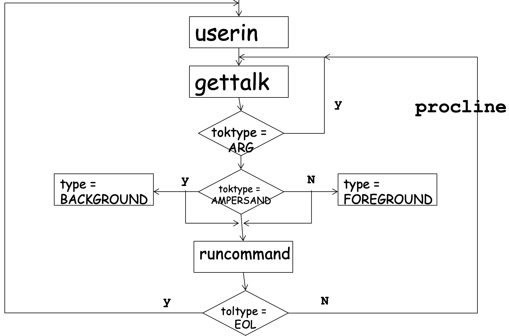

# CH5 Process
0. [Program Layout](#0.-Program-Layout)
1. [프로세스 표기법](#1.-프로세스-표기법)
2. [프로세스 생성](#2.-프로세스-생성)
    * [`getpid()`](#`getpid()`)
    * [`getppid()`](#`getppid()`)
    * [`fork()`](#`fork()`)
3. [`exec`로 새로운 프로그램 실행](#3.-`exec`로-새로운-프로그램-실행)
    * [`exec` family](#`exec`-family)
4. [`exec`와 `fork` 함께 사용하기](#4.-`exec`와-`fork`-함께-사용하기)
5. [상속되는 데이터와 file descriptor](#5.-상속되는-데이터와-file-descriptor)
6. [`exit`로 프로세스 종료](#6.-`exit`로-프로세스-종료)
    * [`exit()`](#`exit()`)
7. [프로세스 동기화](#7.-프로세스-동기화)
    * [`wait()`](#`wait()`)
    * [`waitpid()`](#`waitpid()`)
8. [Zombie and premature 종료](#8.-Zombie-and-premature-종료)
9. [`smallsh` command processor](#9.-`smallsh`-command-processor)
10. [Process 속성](#10.-Process-속성)
    * [pid](#pid)
    * [Process group과 process group-id](#Process-group과-process-group-id)
    * [`setpgid()`](#`setpgid()`)

* * * 
## 0. Program Layout
### `main()` 함수
```c++
int main(int argc, char* argv[]);
```
* arguments
    |name|desc|
    |---|---|
    |argc|command-line 인수의 수|
    |argv|인수를 가리키는 포인터 배열|
* 커널의 `exec` 함수 중 하나로 C 프로그램이 실행되면, main 함수가 실행되기 전에 special start-up routine이 호출된다.
* 실행가능 한 프로그램 파일은 이 루틴을 프로그램의 시작 주소로 지정한다.
* 이 start-up 루틴은 커널로부터 값을 가져온다.
    1. command-line arguments
        - 프로그램이 실행될 때, `exec`를 수행하는 프로세스는 새로운 프로그램에게 command-line arguments를 전달할 수 있다.
    2. environment variables
        - character pointer의 배열
        - 포인터 배열의 주소는 전역 변수 `environ`을 포함한다.
        - `getenv`나 `putenv`로 접근할 수 있다.
        - 대부분 UNIX 시스템은 main 함수에게 세 번째 인수로 제공한다.   
        

### Memory Layout a C Program
* C 프로그램의 구성   
       
    - text(Code) segment
        + 실행될 프로그램 명령
    - initialized data segment
        + 초기화된 전역 변수와 정적 변수
    - uninitialized data segment(bss)
        + 초기화되지 않은 전역 변수와 정적 변수
        + segment의 데이터는 프로그램이 실행되기 전에 커널에 의해 0 또는 null로 초기화됨
    - Stack
        + 로컬 변수 및 함수가 저장되는 영역
        + 함수가 호출될 때, 함수의 자동 변수는 스택의 맨 위에 할당
        + 함수가 리턴될 때, 변수들은 해제된다.
    - Heap
        + 동적 메모리가 할당되는 영역
* 초기화되지 data segment의 않은 상수는 디스크에 있는 프로그램 파일에 저장되지 않는다.
* 프로그램 파일에 저장되어야 하는 프로그램의 부분은 test segment와 초기화된 데이터이다.
* 전역 변수 초기화하는 경우가 컴파일 했을 때 크기가 더 커진다.
* * *
## 1. 프로세스 표기법
### Process
* 실행 중인 프로그램의 인스턴스
* 프로세스는 실행중인 프로그램에 해당한다.
* 프로그램 != 프로세스
* 프로세스이 포함하는 것들
    - 프로그램 코드
    - 프로그램 변수안의 데이터 값
    - 하드웨어 레지스터
    - 프로그램 스택
* 프로세스는 process-id(pid)로 식별된다.
* 쉘은 새로운 프로세스를 생성할 수 있다.
* 프로세스 환경
    - 부모 프로세스에서부터 시작된다.
    - 파일 시스템의 디렉토리 트리와 유사한 계층 구조를 제공
    - **init** process
        + 프로세스 트리의 최상단에 위치
        + 궁극적으로 모든 시스템과 사용자 프로세스의 조상
* 프로세스 생성 및 조작을 위한 system call 제공
* * *
## 2. 프로세스 생성
* PID   
    - 모든 프로세스는 고유의 process ID를 갖고 있다.
    - 음수 아님
    - 유니크하지만 pid는 재사용될 수 있다.

### `getpid()`
```c++
pid_t getpid(void);
```
|status|return value|
|---|---|
|success|호출된 프로세스의 PID|

### `getppid()`
```c++
pid_t getppid(void);
```
|status|return value|
|---|---|
|success|호출된 프로세스의 PPID|


### `fork()`
* 호출한 프로세스의 복제한 새로운 프로세스 생성
```c++
pid_t fork(void);
```
|status|return value|
|---|---|
|success|child process일 때 0, 부모일 때 child의 PID|
|error|-1|



* 자식 프로세스는 부모 프로세스의 data space, heap, stack를 복사해간다.
* 부모와 자식은 서로 메모리를 공유하지 않는다.
* 부모와 자식은 text segment를 공유한다.
* 자식과 부모 프로세스 간 실행 순서는 스케줄링 알고리즘이 결정하기 때문에 사용자가 알 수 없다. 
* **pid**로 부모와 자식을 구분할 수 있다.
    - parent : non-zero, positive integer
    - child : 0
* Limit error : 프로세스의 수에 제한이 있음

* * *
## 3. `exec`로 새로운 프로그램 실행
### `exec` family
* `exec` family는 새로운 프로그램의 실행 초기화에 사용된다.
* 새로운 프로세스를 생성하는 것이 아니기 때문에 `exec`로 인해 pid가 변경되지는 않는다.
* `exec`는 단지 디스크에서 현재 프로세스를 새로운 프로그램으로 교체한다.
    - text, data, heap, stack segment
* `exec`가 리턴하면 호출을 실패한 것

```c++
int execl(const char* pathname, const char* arg0, .../*NULL*/);
int execv(const char* pathname, char* const argv[]);

// 현재 환경 변수 대신 인자의 환경 변수 사용
int execle(const char* pathname, const char* arg0, .../*NULL*/, char* const envp[]);
int execve(const char* pathname, char* const argv[], char* const envp[]);

// PATH 환경 변수에서 filename 찾음
int execlp(const char* filename, const char* arg0, .../*NULL*/);
int execvp(const char* filename, char* const argv[]);
```
|status|return value|
|---|---|
|success|**no return**|
|error|-1|

* l : list
* v : array
* e : environment
* p : path 환경 변수

* * *

## 4. `exec`와 `fork` 함께 사용하기
||program file|process|
|---|---|---|
|`fork`|same|diff(새로 생성)|
|`exec`|diff(덮어 써버림)|same|
```c++
#include <unistd.h>

int fatal(char *s){
   perror(s);
   exit(1);
}

int main(){
   pid_t pid;
   switch (pid = fork()){
   case -1:
      fatal("fork failed");
   case 0:
      /*자식이 exec을 호출 */
      // 부모의 코드를 그대로 복제했기 때문에 exec 실행
      execl("/bin/ls", "ls", "-l", (char*)0);   // 데이터 덮어 쓰기
      fatal("exec failed");     // 호출 실패 시 에러 생성
      break;
   default:
      /* 부모가 자식이 끝날 때까지 수행이 일시 중단하기 위해 wait을 호출 */
      wait((int*)0);
      printf("ls completed\n");
      exit(0);
   }	
}
```
* * *
## 5. 상속되는 데이터와 file descriptor
### `fork()` 와 file, data
 

* 부모에서 열린 모든 파일은 자식에서도 열려 있다.
* 자식과 부모는 **file offset을 공유**한다.
    - 자식 프로세스에서 표준 출력을 쓰면 부모의 offset도 업데이트된다.

### 부모에게서 상속되는 속성들(`fork()`)
* *Real user ID, real group ID*
* *Supplementary group IDs*
* *Process group ID*
* *Session ID*
* *Controlling terminal*
* *Current working directory*
* *Root directory*
* *File mode creation mask*
* *Resource limits*
* **effective user ID, effective group ID**
* **The set-user-ID and set-group-ID flags**
* **Signal mask and dispositions**
* **The close-on-exec flag for any open file descriptors**
* **Environment**
* **Attached shared memory segments**
* **Memory mappings**

### 부모와 자식의 차이
* `fork`의 리턴 값
* pid
* ppid
* 자식의 tms_utime, tms_stime, tms_cutime, tms_cstime 값은 0으로 세팅
* 부모가 세팅한 lock file은 자식에게 상속되지 않음
* 자식에서 `alarm()` pending 초기화(상속되지 않음)
* 세팅된 pending signal은 자식에서 초기화(상속되지 않음)

### `exec`와 파일 열기
* 완전히 새로운 프로그램이 `exec`로 시작될 때, 원본 프로그램에서 연 파일은 계속 open한 상태를 유지한다.
* file offset은 `exec` 호출로 인해 바뀌지 않는다.
* close-on-exec flag를 설정하면, `exec`이 실행될 때 열린 파일이 닫힌다.

### 호출한 프로세스에게서 상속되는 속성들(`exec()`)
* *Real user ID and real group ID*
* *Supplementary group IDs*
* *Process group ID*
* *Session ID*
* *Controlling terminal*
* *Current working directory*
* *Root directory*
* *File mode creation mask*
* *Resource limits*
* **Time left until alarm clock**
* **File locks**
* **Process signal mask**
* **Pending signals**
* **Values for tms_utime, tms_stime, tms_cutime, and tms_cstime**

* * *
## 6. `exit`로 프로세스 종료
* 프로세스 종료하는 8가지 방식
    - 정상적인 종료
        1. main return
        2. `exit` 호출
        3. `_exit` or `_Exit` 호출
        4. start routine에서 마지막 스레드 return
        5. 마지막 스레드로에서 pthread `_exit` 호출
    - 비정상적인 종료
        1. `abort` 호출
        2. 시그널 수신
        3. 취소 요청에 대한 마지막 스레드의 응답

### `exit()`
```c++
// <stdlib.h>
void exit(int status);
void _Exit(int status);

// <unistd.h>
void _exit(int status);
```
* `exit`의 인수 status는 하위 8개 비트를 사용하여 부모 프로세스로 전달된다. 부모 프로세스에서는 상위 8개 비트를 사용하여 받는다.
* 관례상 프로세스가 return
    - 0 : 정상적인 종료
    - 0이 아니면 무언가 잘못되었음
* `_exit`과 `_Exit`은 커널로 즉시 return 된다.
* `exit`는 standart I/O library, 버퍼, 파일 등을 처리한 후 return 된다.
* `exit(0)`은 main에서 `return(0)`을 한 것과 같다.

* * *
## 7. 프로세스 동기화
### 자식 프로세스 동기화
* 프로세스가 종료될 때
    - 커널은 프로세스의 모든 열린 descriptor를 닫고 사용하던 메모리를 해제한다.
    - 커널은 프로세스를 종료하기 위해 proc entry만 유지한다. (pid, 종료 상태-상태(상태), CPU 시간)
    - 이 정보는 종료 과정의 상위 프로세스가 확인할 때까지 남아 있다.
    - 종료 프로세스의 부모는 `wait()`을 통해 이 정보를 확인한다.
    - `wait()` 후 종료 프로세스의 proc entry가 proc table에서 해제된다.

### `wait()`
```c++
pid_t wait(int* statloc);
```
|status|return value|
|---|---|
|success|chidl pid, blocking wait|
|non-blocking wait|0|
|error|-1|

* 자식 프로세스가 실행되는 동안 잠시 suspending 된다.
* 자식 프로세스가 종료되면, 기다리던 부모 프로세스가 재시작된다.
* 하나 이상의 자식 프로세스가 실행중일 때 아무 자식이나 종료될 때 `wait`도 return 된다.
* return value가 -1일 경우, 자식이 존재하지 않는 것이다.
* 부모 프로세스는 자식을 기다리며 무한정 대기할 수 있다.
* statloc으로 자식이 죽을 때 정보를 가져올 수 있다.   
    ```c++
    int status;
    pid = wait(&status);
    ```
### `waitpid()`
```c++
pid_t waitpid(pid_t pid, int* statloc, int options);
```
|status|return value|
|---|---|
|success|chidl pid, blocking wait|
|non-blocking wait|0|
|error|-1|

* arguments
    - pid
        |pid|desc|
        |---|---|
        |-1|아무 자식이나 기다림|
        | > 0 |해당 pid를 가진 자식 프로세스를 기다림|
        |0|호출한 프로세스와 같은 프로세스 그룹인 자식 아무나 기다림|
        | < 0 |해당 pid의 절대값에 해당하는 프로세스 그룹에 속한 자식 아무나 기다림|
    - optoins
        |constant|decs|
        |---|---|
        |WCONTINUE|자식 프로세스가 stop되었다가 다시 continue될 경우 return|
        |WNOHANG|non-blocking wait, 종료된 child가 없으면 0|
        |WUNTRACED|자식 프로세스가 stop될 경우 return|

### `wait()` & `waitpid()` 함수
* `wait()`는 자식 프로세스가 종료될 때까지 부모 프로세스를 block할 수 있다.
* `waitpid()`는 `WNOHANG` 옵션을 이용하여 non-blocking wait을 할 수 있다.
* `waitpid()`는 첫 번째로 종료되는 자식을 기다리는 것이 아니라, waiting할 자식 프로세스를 지정할 수 있다.

* * *
## 8. Zombie and premature 종료
### zombie 프로세스
* 부포 프로세스가 종료된 자식 프로세스를 `wait()`하고 있는 경우
* ps에서 "Z" status
* 좀비는 부모가 `wait()`이나 `waitpid()`를 호출할 때까지 떠돈다.
* 실행은 완료하였지만, process table에 entry가 존재하는 프로세스



### orphan 프로세스
* 자식 프로세스보다 부모 프로세스가 먼저 종료될 경우
* init 프로세스(pid=1)가 고아 프로세스의 부모가 된다.
* init process는 주기적으로 자식을 기다린다.   
    고아 좀비가 제거된다.



* * *
## 9. `smallsh` command processor
### command processor의 기본 로직
```c++
while(EOF not typed)
{
	Get command line from user <- userin()
	Assemble command args and execute <- procline()
    Wait for child
}
```


* * * 
## 10. Process 속성
### pid
```c++
pid_t getpid(void);     // Returns: process ID of calling process
pid_t getppid(void);    // Returns: parent process ID of calling process
uid_t getuid(void);     // Returns: real user ID of calling process
uid_t geteuid(void);    // Returns: effective user ID of calling process
gid_t getgid(void);     // Returns: real group ID of calling process
gid_t getegid(void);    // Returns: effective group ID of calling process
```

### pid 0 & 1
* scheduler process(swapper) : pid 0
    - kernel의 한 부분이고 시스템 프로세스로 알려져 있다.
    - 디스크에 프로그램이 없다.
* init process : pid 1
    - bootstrap 절차가 끝날 때 커널에 의해 호출된다.
    - 절대 죽지 않는다.
    - swapper처럼 superuser 특권으로 돌아가지만, 커널 안의 시스템 프로세스가 아니고 **user process**이다.

### Process group과 process group-id
* 프로세스 그룹은 하나 이상의 프로세스가 모인 집합이다.
    - 보통 같은 job으로 연관되어 있다.
    - pipe로 연결되어 있다.
* 각 프로세스 그룹은 유니크한 프로세스 group-id를 갖는다.
* 프로세스 gid는 pid와 유사하다.
    - 양수
    - pid_t data type
* 각 프로세스 그룹은 프로세스 그룹 리더를 가질 수 있다.
    - pid == pgid 이면 그룹 리더이다.
```c++
pid_t getpgrp(void);        // Returns: process group ID of calling process
pid_t getpgid(pid_t pid);   // Returns: process group ID if OK, -1 on error
```

### `setpgid()`
* 프로세스 group-id 변경
```c++
int setpgid(pid_t pid, pid_t pgid);     // Returns: 0 if OK, -1 on error
```
* arguments
    |arg|desc|
    |---|---|
    |`pid` == `pgid`|해당 pid 프로세스가 프로세스 그룹 리더가 됨|
    |`pid` == 0|호출한 프로세스의 pid 사용|
    |`pgid` == 0|해당 pid 프로세스가 프로세스 그룹 id로 사용|

* process-id가 `pid`인 프로세스의 process group-id를 `pgid`로 변경한다.
* 프로세스는 오직 **자기 자신 혹은 그의 자식 프로세스의 pgid만** 변경할 수 있다.
* 자식 프로세스가 `exec()`를 호출한 후엔 pgid를 변경할 수 없다.

### Session과 session-id
* session은 하나 이상의 프로세스 그룹이 모인 집합이다.
* 세션 안에 있는 프로세스 그룹은 single foreground process group과 하나 이상의 background process group으로 나뉜다.

### 현재 작업 디렉토리와 루트 디렉토리
* 현재 작업 디렉토리
    - 현재 작업 중인 디렉토리는 프로세스에서 시작된 `fork()`와 `exec()`로부터 상속된다.
    - 프로세스마다 가지고 있는 속성이다.
    - `chdir()`를 이용하여 자식 프로세스가 위치를 변경하여도, 부모 프로세스의 현재 작업 중인 디렉토리는 변하지 않는다.
* 현재 루트 디렉토리
    - 각 프로세스는 절대 경로 탐색에 사용되는 루트 디렉토리와 관련이 있다.
    - 계층 파일 시스템이 시작되는 곳

