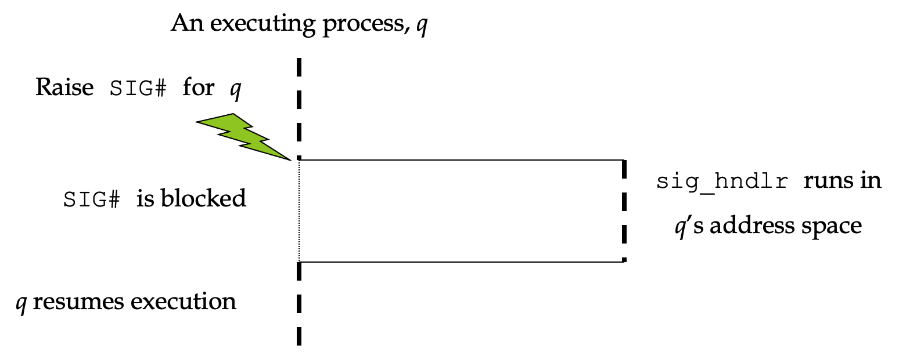

# CH6 signal
1. [Introduction](#1.-Introduction)
2. [Signal Handling](#2.-Signal-Handling)
    * [Signal Set](#Signal-Set)
    * [`sigaction()`](#`sigaction()`)
    * [`slow()`](#`slow()`)
    * [`sigsetjmp()` 과 `siglongjmp()`](#`sigsetjmp()`-과-`siglongjmp()`)
3. [signal blocking](#3.-signal-blocking)
    * [`sigprocmask()`](#`sigprocmask()`)
4. [Sending signal](#4.-Sending-signal)
    * [`kill()`](#`kill()`)
    * [`raise()`](#`raise()`)
    * [`pause()`](#`pause()`)

* * * 
## 1. Introduction
### Signal 개념
* 프로세스에게 이벤트 발생을 알리는 소프트웨어 notification or interrupt
* 비동기적 이벤트를 핸들링하는 방법을 제공
* signal인지 아닌지 확인할 수 있는 변수는 없다.
* 모든 signal은 "SIG" 로 시작하는 자신의 이름을 가지고 있다.
    - <signal.h>에 정의되어 있다.
* signal을 생성할 수 있는 수 많은 조건들이 있다.
* signal 생성 : signal이 유발하는 이벤트가 발생하였을 경우
* signal 전달 : 프로세스가 signal 기반으로 액션을 취할 경우
* signal lifetime :  생성과 전달 사이의 간격
* pending : 생성은 되었지만 전달은 아직 되지 않은 signal 상태
* caught : signal이 전달되어서 프로세스가 signal handler를 실행할 경우
* 프로그램은 `sigation()`을 호출하여 signal handler를 설치한다. 
    - `sigaction()`의 인수는 유저가 정의한 함수

* 종류
    |name|desc|
    |---|---|
    |SIGABRT|`abort()` 호출에 의해 생성|
    |SIGALRM|타이머의 알람이 만료되었을 경우 생성|
    |SIGCHLD|자식 프로세스가 종료되거나 정지되었을 경우, 부모 프로세스에게 전달|
    |SIGCONT|정지된 프로세스가 다시 실행되었을 경우 전달|
    |SIGFPE|산술적 예외가 발생할 경우 생성, 0으로 나누기 등|
    |SIGILL|Illegal 하드웨어 접근을 수행하였을 경우 생성|
    |SIGINT|터미널로 interrupt key(Ctrl+C)가 전달되었을 경우 foreground process에게 전달|
    |**SIGKILL**|catch하거나 무시할 수 없다. 프로세스를 죽이는 확인한 방법!|
    |SIGPIPE|pipe를 사용하였으나 pipe를 받는 프로세스가 종료될 경우 발생|
    |SIGSEGV|유효하지 않은 메모리 참조가 발생하였을 경우 생성(core dumped)|
    |SIGTERM|`kill()` 커맨드로부터 발생|
    |**SIGTSTP**|터미널로 (Ctrl+Z)가 전달되었을 경우 foreground process에게 전달|
    |SIGUSR1|유저가 설정한 signal1|
    |SIGUSR2|유저가 설정한 signal2|
    |**SIGSTOP**|catch하거나 무시할 수 없다. job control signal|

* * *
## 2. Signal Handling
### signal handling
* 시그널이 발생할 경우에 할 수 있는 일
    1. 무시한다.
        - `SIGKILL`과 `SIGSTOP`은 무시할 수 없다.
    2. User-defined action
        - signal이 발생할 경우 커널에게 사용자 정의 함수를 사용할 것이라고 명시해야 한다(signal handler)
        - `SIGKILL`과 `SIGSTOP`은 catch 되지 않는다.
    3. default action
        - 모든 signal은 기본 처리방식이 있다.
        - 보통 프로세스를 종료시키는 것이다.
    
#### user-defined action


* catch된 signal이 프로세스에 의해 처리될 때, 정상 명령 시퀀스는 일시적으로 signal handler에 의해 중단된다.
* 그 후 프로세스는 계속해서 실행되지만, signal handler는 이제 실행된다.
* signal handler가 return 되면, 프로세스는 signal을 catch하였을 때 실행 중이었던 정상 명령 시퀀스를 이어서 실행한다.
* 하지만 signal handler에서, signal이 catch되었을 때 프로세스가 어디를 실행중이었는지 알 수 없다.

### Process signal mask
* signal이 발생할 때 취한 액션은 현재 signal handler와 process signal mask에 달려 있다.
* signal mask는 **현재 block된 시그널의 리스트**를 포함한다.
* 프로그램은 `sigprocmask`를 이용하여 process signal mask를 변경하고 signal을 block한다. 
* 자식 프로세스는 `fork()`와 `exec()` 후에도 signal mask를 상속받는다.

### signal block
* process signal mask == 현재 block된 signal의 리스트
* signal을 catch하는 함수의 코드가 실행되기 직전에 프로세스의 signal mask에 추가된다.(signal block)
* 함수의 코드가 끝나면 return 되기 전에 signal mask에서 삭제된다.(signal unblock)
* signal이 catch가 되면 해당 signal은 blocking이 되기 때문에, signal을 여러 개 넣어봤자 하나만 인식한다.

### Signal handling과 `exec()`
* 프로그램이 실행될 때 모든 시그널의 status는 default이거나 무시된다.
* 자연스럽게, `exec()`을 호출하는 프로세스에 의해 catch된 signal은 새로운 프로그램에서 같은 함수에 의해 catch될 수 없다.
    - 호출자에 있는 signal-catch 함수의 주소가 새로운 프로그램 파일에서는 아마도 의미가 없을 수 있다.
* `fork()`를 호출하면, 자식 프로세는 부모의 signal disposition(시그널 처리)을 상속받는다.
    - 자식은 부모의 메모리 이미지를 그대로 복사하기 때문에, signal-catch 함수의 주소가 자식에게 의미가 있다.

### Signal Set
* signal을 모아놓는 비트맵
* signal을 핸들링 중에 signal set에 있는 signal이 들어오는 것을 허용하지 않기 위해서 `sigprocmask()`를 사용하여 관리
```c++
#include <signal.h>

// All four return: 0 if OK, -1 on error
int sigemptyset(sigset_t *set);
int sigfillset(sigset_t *set);
int sigaddset(sigset_t *set, int signo);
int sigdelset(sigset_t *set, int signo);
 
 //Returns: 1 if true, 0 if false, -1 on error
int sigismember(const sigset_t *set, int signo);    
```

### `sigaction()`
* 특정 signal과 관련된 액션을 관리하거나 수정할 수 있다.
```c++
int sigaction(int signo, const struct sigaction* restrict act, struct sigaction* restrict oact);
```
|status|return value|
|---|---|
|success|0|
|error|-1|

* argument
    |name|desc|
    |---|---|
    |signo|signal number|
    |act|수정한 액션|
    |oact|이전 액션|
* sigaction struct
    ```c++
    struct sigaction {
        void (*sa_handler)(int);   /* addr of signal handler, or SIG_IGN, or SIG_DFL */
        sigset_t sa_mask;          /* additional signals to block */
        int sa_flags;              /* signal options, Figure 10.16 */

        /* alternate handler */
        void (*sa_sigaction)(int, siginfo_t *, void *);
    };
    ```
    |name|desc|
    |---|---|
    |sa_handler|signal-catch 함수의 주소|
    |sa_mask|signal-catch 함수가 호출되기 전에 프로세스의 signal mask에 추가되는 signal set
    |sa_flags|signal을 핸들링하는 옵션|

    - sa_flags
        |name|desc|
        |---|---|
        |SA_INTERRUPT|
        |SA_NOCLDSTOP|
        |SA_NOCLDWAIT|
        |SA_NODEFER|
        |SA_ONSTACK|
        |**SA_RESETHAND**|signal handling이 끝난 후 모든 것을 리셋하여 원위치시킴|
        |**SA_RESTART**|`slow()`이 실행 중에 signal이 들어오면 handling 함수를 다시 실행시킴|
        |SA_SIGINFO|설정할 경우 sa_handler 대신 sa_sigcation 함수를 사용, 시그널에 대한 정보를 함께 인수로 전달|
    - sa_mask는 `sigemptyset()`을 이용하여 초기화해야 한다.

### signal과 system call
* system call을 실행하는 도중에 프로세스가 시그널을 받으면 그 시그널은 system call이 완료될 때까지 영향이 없다.

### `slow()`
* `slow()`에서 프로세스가 블락되었을 때 시그널을 catch하면, system call이 중단된다.
* system call은 에러를 리턴하고 errno는 `EINTR`로 설정된다.
* 영원히 block될 수 있다.
* pipes, terminal devices, network devices
* `pause()`, `wait()`
* 특정 `ioctl` 연산
* 몇몇 interprocess communication 함수
* disk I/O와 관련되지 않은 것
* `sigaction()`은 system call이 중단되었을 경우 자동으로 재시작하는 것을 허용한다.
* `sa_flags` 변수가 `SA_RESTART`로 세팅되어 있는 경우, system call은 재시작하고 errno는 초기화된다.

### additional information about the signal
* signal-catch 함수가 리턴되면, 프로세스의 signal mask는 이전 값으로 리셋된다.
* signal handler가 호출될 때마다 특정 signal을 block시킬 수 있다.(sigaction.sa_mask 사용)
* signal handler가 호출되었을 때 OS는 signal mask에 전달된 signal을 포함시킨다.
* 발생한 signal을 처리할 때, 이 signal 처리를 완료할 때까지 다른 signal이 발생하는 것을 block시킬 수 있다.
* 같은 signal이 여러번 반복되는 것은 큐에 추가되지 않는다.

### `sigsetjmp()` 과 `siglongjmp()`
* signal handler에서 분기할 때 항상 사용해야 한다.
* `savemask`가 0이 아닐 경우, `sigsetjmp()` 또한 `env`에 프로세스의 현재 signal mask를 저장한다.
* `siglongjmp()`이 호출될 때 0이 아닌 `savemask`로 `sigsetjmp()`를 호출하여 `env` 인자가 저장된 경우, `siglongjmp()`는 저장된 signal mask를 복원한다.

```c++
int sigsetjmp(sigjmp_buf env, int savemask);
void siglongjmp(sigjmp_buf env, int val);
```
* `sigsetjmp()`
    * return
        |status|return value|desc|
        |---|---|---|
        |directly called by `sigsetjmp()`|0|직접적으로 `sigsetjmp()` 호출했을 때|
        |returning to `siglongjmp()`|not 0|signal 처리 후 `siglongjmp()`의 리턴 값|

    * argumnet
        |name|desc|
        |---|---|
        |env|프로세스의 현재 signal mask를 저장할 변수|
        |savemask|0이 아닐 경우 `env`에 signal mask 저장|

* `siglongjmp()`
    * argumnet
        |name|desc|
        |---|---|
        |env|`sigsetjmp()`에서 저장했던 signal mask 변수|
        |val|`sigsetjmp()`의 리턴값으로 전달할 값|
* * *
## 3. signal blocking
### `sigprocmask()`
* 프로세스의 signal mask는 해당 프로세스에 전달되어 block된 signal set이다.
```c++
int sigprocmask(int how, const sigset_t& restrict set, sigset_t* restrict oset);
```
|status|return value|
|---|---|
|success|0|
|error|-1|

* argument
    |name|desc|
    |---|---|
    |set|null pointer일 경우 signal mask는 변경되지 않고 `how`도 무시된다.|
    |how|어떻게 처리할 건지|

    - how
        |how|desc|
        |---|---|
        |SIG_BLOCK|signal set에서 추가한다|
        |SIG_UNBLOCK|signal set에서 삭제한다|
        |SIG_SETMASK|signal set에 해당 signal을 추가한다|

* * *
## 4. Sending signal
* Permision to send signal
    - superuser는 모든 프로세스에게 signal을 보낼 수 있다.
    - sender의 ruid, ruid는 
### `kill()`
* 프로세스 혹은 프로세스 그룹에게 signal을 보낸다.
```c++
int kill(pid_t pid, int signo);
```
|status|return value|
|---|---|
|success|0|
|error|-1|

* pid
    |pid|decs|
    |---|---|
    | > 0 |process-id가 `pid`인 프로세스에게 signal 보냄|
    | == 0 |현재 프로세스 그룹의 모든 프로세스에게 signal 보냄|
    | < 0 |`pid`의 절대값이 gpid인 모든 프로세스에게 signal 보냄|
    | == -1 |sender가 signal을 보낼 수 있는 권한을 갖는 시스템의 모든 프로세스로 signal 보냄|


### `raise()`
* 프로세스 자기 자신에게 signal을 보낸다.
```c++
int raise(int signo);
```
|status|return value|
|---|---|
|success|0|
|error|-1|

```c++
// 같은 코드
raise(signo);
kill(getpid(), signo);

```
### `pause()`
```c++
int pause(void);
```
|status|return value|
|---|---|
|errno가 EINTR로 세팅|-1|

* signal이 catch될 때까지 호출한 프로세스를 suspending 시킨다.
* action이 프로세스를 종료시키는 것이면, `pause()` 쉘은 return되지 않는다.
* action이 signal-catch 함수를 실행시키는 것이면, `pause()` 쉘은 signal-catch 함수가 리턴된 후에 리턴된다.
