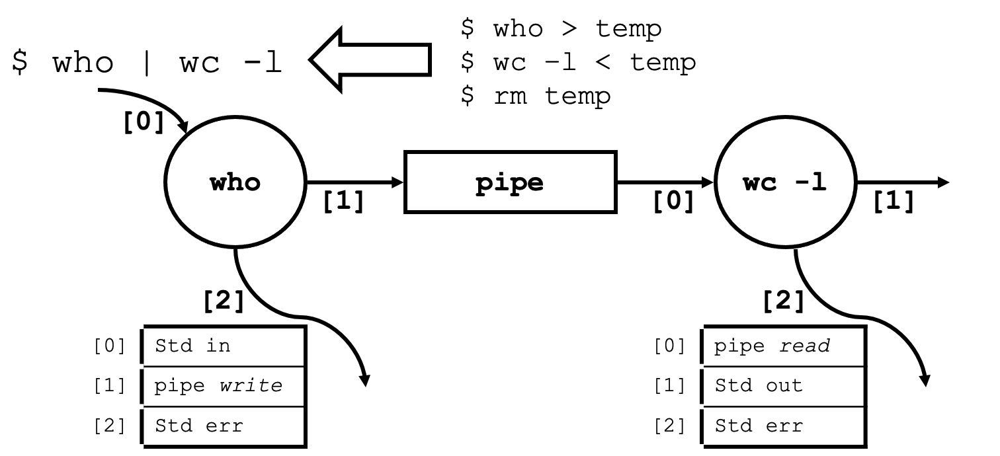
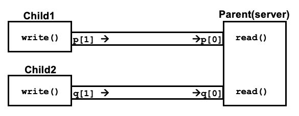

# CH7 pipe
1. [pipe](#1.-pipe)
    * [`pipe()`](#`pipe()`)
2. [FIFO](#2.-FIFO)
    * [`mkfifo()`](#`mkfifo()`)
3. [I/O Multiplexing](#3.-I/O-Multiplexing)
    * [`select()`](#`select()`)
    * [`FD` family](#`FD`-family)

* * * 
## 1. pipe
### pipes
* pipe는 유닉스 시스템 IPC에서 제일 오래되었고, 모든 유닉스 시스템에서 지원한다.
* 가장 간단한 interprocess communication 메커니즘

* 예시
    ```
    $ who | wc -l
    ```
    
    
    * who 명령어의 standard output이 pipe write로 변경됨
    * wc 명령어의 standard input이 pipe read로 변경됨

### `pipe()`
```c++
int pipe(int filedes[2]);
```
|status|return value|
|---|---|
|success|0|
|error|-1|

* arguments
    - filedes
        |index|desc|
        |---|---|
        |0|read|
        |1|write|

* FIFO 기준
* `lseek()`이 pipe에서 동작하지 않기 때문에 이 순서는 변경할 수 없다.
* 2가지 제한
    - half duplex(read하는 프로세스는 read만 하고, write하는 프로세스는 write만 함)
    - pipe는 자식과 부모 사이에서 사용된다.

#### file read, write, close
* 프로세스가 pipe에서 `read()`를 호출했을 때
    - pipe가 비어있지 않으면 : `read()`가 즉시 리턴
    - pipe가 비었으면 : pipe에 무언가 써질 때까지 `read()` block
* 프로세스가 pipe에서 `write()`를 호출했을 때
    - pipe가 가득 차있지 않으면 : `write()` 즉시 리턴
    - pipe가 가득 차있으면 : pipe에 여유 공간이 생길 때까지 `write()` block
* pipe의 한 쪽이 닫힌 경우
    - `write()` 쪽이 닫힌 경우
        + `read()`는 모든 데이터를 읽을 후에 EOF를 나타내기 위해 0을 리턴
        + `read()`가 죽으면 `write()`도 따라 죽음
    - `read()` 쪽이 닫힌 경우
        + `SIGPIPE` 발생
        + signal을 무시하거나 catch한 후 signal handler로부터 리턴할 경우, `write()`는 -1를 리턴하고 errno를 `EPIPE`로 설정한다.
        + `write()`가 죽는다고 `read()`가 죽지는 않음(영원히 block 가능)
* pipe에서 동시에 프로세스들이 `read()`와 `write()`를 한다면 혼란을 초래할 것이다.
    - 이걸 피하기 위해, 각 프로세스는 `read()`만 하거나 `write()`만 해야 하고, **필요하지 않는 file descriptor는 `close()`해야 한다.**

### Blocking & Non-Blocking
* system call은 호출자를 영원히 block할 수 있다.
    - `read()`는 특정 파일 타입(pipes, terminal devices, network device)에 데이터가 존재하지 않으면 block된다.
        + read할 게 없으면 block
    - `write()`는 파일 타입(꽉 찬 pipe, network flow control)이 데이터에 즉시 접근할 수 없을 때 block된다.
        + write할 자리 없으면 block
    - `open()`는 특정 파일(FIFO)에 어떤 조건이 발생하기 전까지 block된다.
* 주어진 descriptor에 대해 nonblocking I/O를 지정하는 방법
    1. descriptor를 얻기 위해 `open()`을 호출한 경우   
        -> `O_NONBLOCK` 지정
    2. descriptor가 이미 `open()` 되어 있다면   
        -> `O_NONBLOCK` flag를 설정하기 위해 `fcntl()` 호출

* * *
## 2. FIFO
### FIFO
* FIFO는 named pipe라고도 불림
    - pipe는 이름을 지정할 수 없지만 FIFO는 지정할 수 있음
* pipe는 공통의 조상이 pipe를 생성하였을 때 관련 프로세스간에만 사용할 수 있다.
* FIFO는 관련이 없는 프로세스 간에는 데이터를 교환할 수 있다.
* FIFO 또한 소유자, 크기, 연관된 접근 권한을 가지고 있다.
* UNIX 파일처럼 open, close, delete 될 수 있다.
* read-only 혹은 write-only로만 open될 수 있다.
* `S_ISFIFO` 매크로를 통해 테스트할 수 있다.
    - `st_mode`
* FIFO는 선입선출이다.
* pipe나 FIFO에 `write()`할 때는 데이터에 이어 쓰기가 되지만, `read()`는 항상 pipe나 FIFO의 처음 부분이 return 된다.
* pipe나 FIFO에서 `lseek()`을 호출하면 `ESPIPE` 에러가 리턴된다. 못씀!

### `mkfifo()`
* FIFO를 생성한다.
```c++
int mkfifo(const char* pathname, mode_t mode);
```
|status|return value|
|---|---|
|success|0|
|error|-1|

* argument
    |name|desc|
    |---|---|
    |pathname|FIFO file name|
    |mode|permission mask|

* `O_NONBLOCK`이 없이 `open()`한 경우
    - read-only : FIFO파일이 write로 open될 때까지 block
    - write-only : FIFO파일이 read로 open될 때까지 block
* `O_NONBLOCK`로 `open()`한 경우
    - read-only : file descriptor 즉시 return
    - write-only : FIFO 파일을 read로 open하지 않은 경우 -1을 return, errno가 `ENXIO`로 세팅

* FIFO 파일이 read, write, close 될 경우 -> [pipe와 동일](#file-read,-write,-close)
* 예시
    ```c++
    /* rcvmessage -- fifo를 통해 메시지를 받는다. */
    #include <fcntl.h>
    #include <stdio.h>
    #include <errno.h>
    #define MSGSIZ		63
    char *fifo = "fifo";

    main (int argc, char **argv){
        int fd;
        char msgbuf[MSGSIZ+1];

        if (mkfifo(fifo, 0666) == -1){
            if (errno != EEXIST) fatal ("receiver: mkfifo");
        }

        if ((fd = open(fifo, O_RDWR)) < 0) fatal ("fifo open failed");

        for(;;){
            if (read(fd, msgbuf, MSGSIZ+1) <0) fatal ("message read failed");

        /*
        * 메시지를 프린트한다 ; 실제로는 보다 흥미 있는 일이 수행된다.
        */
            printf ("message received:%s\n", msgbuf);
        }
    }
    ```
    - fifo file을 오픈할 때 read만 할건데 `O_RDWR` 옵션을 준 이유❓
        1. write하는 프로세스가 없어서 open할 때 block됨
        2. **`read()`할 때 write하는 프로세스가 없기 때문에 -1을 리턴하게 되어 하는 일 없이 무한루프에 빠지게 됨(busy waiting)**
    
* * *
## 3. I/O Multiplexing
* 한 개의 descriptor로부터 `read()`를 하고 다른 파일에 `write()`할 경우에, loop 안에  blocking I/O를 사용할 수 있다.
    ```c++
    while((n = read(STDIN_FILENO, buf, BUFSIZ)) > 0) {
        if(write(STDOUT_FILENO, buf, n) != n) err_sys("write error");
    }
    ```
* 2개의 descriptor로부터 read할 경우에는?   
    
    - 이런 경우를 해결할 해결책이 필요함 -> **Multiplexign I/O Model**

### `select()`
```c++
int select(
    int nfds,
    fd_set *readfds,
    fd_set *writefds,
    fd_set *exceptfds,
    struct timeval *timeout
);
```
|status|return value|
|---|---|
|success|준비된 descriptor의 수|
|timeout|0|
|error|-1|

* argument
    |name|desc|
    |---|---|
    |nfds|어떤 descriptor에 관심이 있는지|
    |readfds|주어진 descriptor로부터 read를 원하는지|
    |writefds|주어진 descriptor로부터 write를 원하는지|
    |exceptfds|주어진 descriptor에 대한 예외 조건에 관심이 있는지|
    |timeout|얼마나 기다릴건지|

    - nfds
        + fd의 실제수

    - timeout
        |value|desc|
        |---|---|
        |NULL|wait forever, signal이 catch되거나 descriptor가 준비되면 return|
        |0|아무도 기다리지 않음|
        |not 0|그 수만큼 기다림|
    - readfds, writefds, execptfds
        + 안궁금하면 NULL로 쓰면 됨

* `fd_set`은 ready file descriptor의 bitmap

### `FD` family
```c++
int FD_ISSET(int fd, fd_set* fdset);
```
|status|return value|
|---|---|
|fd가 set에 있는 경우|not 0|
|그 외|1|

```c++
void FD_CLR(int fd, fd_set* fdset);
void FD_SET(int fd, fd_set* fdset);
void FD_ZERO(fd_set* fdset);
```

* 예시
    - 3개의 자식 프로세스
    - 3개의 pipe
    - 
    ```c++
    #include <sys/time.h>
    #include <sys/wait.h>
    #define MSGSIZE   6

    char *msg1 = "hello";
    char *msg2 = "bye!!";
    void parent(int [][]);
    int child(int[]);

    int main(){
        int pip[3][2];
        int i;

        for (i = 0; i < 3; i++){
            if (pipe(pip[i]) == -1) fatal ("pipe call");
            switch (fork()){
                case -1:  /* 오류 */    fatal ("fork call");
                case 0:   /* 자식 */    child (pip[i]);
            }
        }
        parent (pip);
        exit (0);
    }

    void parent(int p[3][2]){
        char buf[MSGSIZE], ch; 
        fd_set set, master;   
        int i;
        
        // write pipe 닫음
        for (i = 0; i < 3; i++)  close (p[i][1]);

        // master fd_set 0으로 초기화
        FD_ZERO (&master);
        FD_SET (0, &master);
        // master read fd만 설정
        for (i = 0; i <3; i++) FD_SET (p[i][0], &master);

        // set fd에서 read 여부 확인
        while (set = master, select (p[2][1]+1, &set, NULL, NULL, NULL) > 0){
            // standard in fd
            if (FD_ISSET(0, &set)){
                printf ("From standard input...");
                read (0, &ch, 1);
                printf ("%c\n", ch);
            }

            // fd의 read 확인
            for (i = 0; i < 3; i++){
                if (FD_ISSET(p[i][0], & set)){
                    if (read(p[i][0], buf MSGSIZE)>0){
                    printf ("Message from child%d\n", i);
                    printf ("MSG=%s\n",buf);        }
                }
            }

            if (waitpid (-1, NULL,WNOHANG) == -1) return;
        }
    }

    int child(int p[2]) {
        int count;
        close (p[0]);

        for (count = 0; count < 2; count++)
        {
            // fd_set 해당 bit에 1로 설정
            write (p[1], msg1, MSGSIZE);
            sleep (getpid() % 4);
        }

        write (p[1], msg2, MSGSIZE);
        exit (0);
    }
    ```

## pipe와 fifo 차이
1. pipe
    - temporary file 생성해서 자식-부모 프로세스끼리 주고 받음
2. fifo
    - 프로세스가 종료되어도 channel은 permernant 하다.