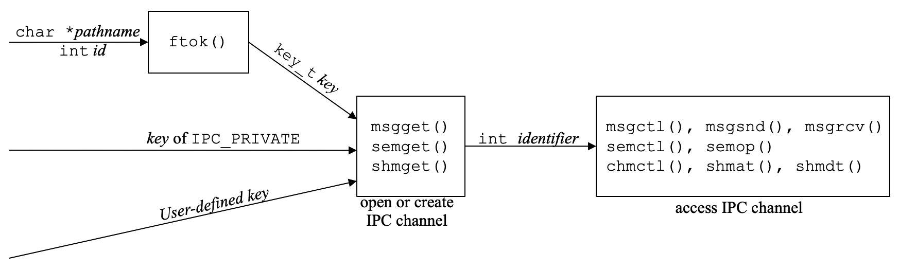
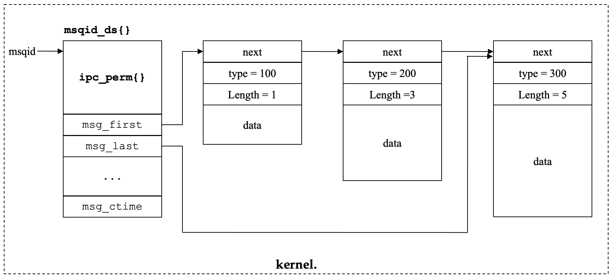
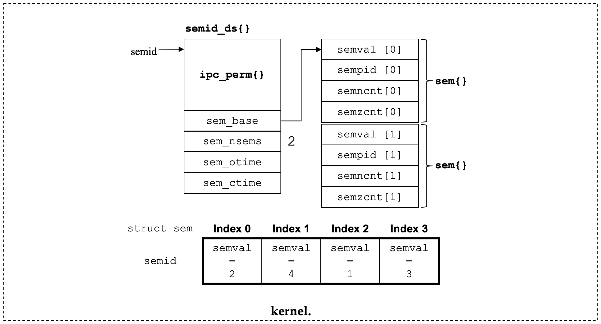
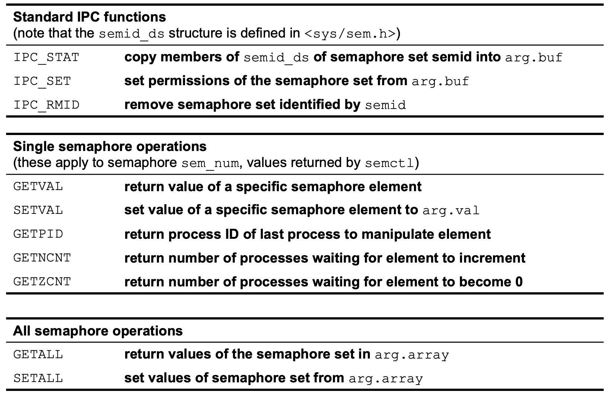

# CH8 IPC
1. [Advanced IPC facilities](#1.-Advanced-IPC-facilities)
    * [`ftok()`](#`ftok()`)

2. [Message Queue](#2.-Message-Queue)
    * [`msgget()`](#`msgget()`)
    * [`msgsnd()`](#`msgsnd()`)
    * [`msgrcv()`](#`msgrcv()`)
    * [`msgctl()`](#`msgctl()`)

3. [Semaphore](#3.-Semaphore)
    * [`semget()`](#`semget()`)
    * [`semctl()`](#`semctl()`)
    * [`semop()`](#`semop()`)
    * [`semop()` : SEM_UNDO](#`semop()`-:-SEM_UNDO)

4. [Shared memory](#4.-Shared-memory)
    * [`shmget()`](#`shmget()`)
    * [`shmat()`](#`shmat()`)
    * [`shmdt()`](#`shmdt()`)
    * [`shmctl()`](#`shmctl()`)

* * *
## 1. Advanced IPC facilities
### IPC(Inter-Process Communication)
* 같은 시스템 내에 있는 프로세스끼리 정보를 공유할 수 있는 메커니즘 제공
    - message queues
    - semaphores
    - shared memory
* 한 번 만들면 계속 사용할 수 있음
* 여러 프로세스가 한 객체로 인식

|mechanism|function|desc|
|---|---|---|
|message queues|msgctl|속성 변경|
||msgget|생성 혹은 접근|
||msgrcv|receive 메세지|
||msgsnd|send 메세지|
|semaphores|semctl|속성 변경|
||semget|생성 혹은 접근|
||semop|operation 실행(wait 혹은 post)|
|shared memory|shmctl|속성 변경|
||shmget|생성, 초기화 혹은 접근|
||shmat|메모리를 프로세스에 attach|
||shmdt|메모리를 프로세스에서 detach|

### Permission Structure
* IPC 객체가 생성될 때, 시스템은 IPC facility status structure도 함께 생성한다.
```c++
struct ipc_perm {     
    uid_t  uid;  /* owner's effective user id */     
    gid_t  gid;  /* owner's effective group id */     
    uid_t  cuid; /* creator's effective user id */     
    gid_t  cgid; /* creator's effective group id */     
    mode_t mode; /* access modes */           
    …
};
```
* uid와 uid는 `mode`와 함께 접근 권한을 결정한다.
* IPC facility가 생성될 때 `umask` 값은 영향을 받지 않는다.
* IPC 생성자와 superuser만 `msgctl()`, `semctl()`, `shmctl()`을 호출하여 `uid`, `gid`, `mode` 필드를 수정할 수 있다.

### Identifiers and Keys
* key
    - IPC 객체의 외부 이름
    - `get()` 함수로부터 IPC 구조체가 생성되면, key가 지정된다.
    - <sys/types.h>에 있는 `key_t` 타입
* Identifier
    - IPC 객체의 내부 이름
    - non-negative integer
    - `get()` 함수로부터 얻어진다.
    - file descriptor와 유사하게 행동하지만, file descriptor와 다른 점은 다른 프로세스가 같은 identifier 값으로 같은 IPC 객체를 사용할 수 있다.

### `ftok()`
```c++
key_t ftok(const char* path, int id):
```
|status|return value|
|---|---|
|success|key|
|error|-1|

* argument
    |name|desc|
    |---|---|
    |path|이미 존재하는 파일|
    |id|`id`의 하위 8비트만 사용됨|

* `path`와 `id`를 IPC key라고 불리는 `key_t`로 변환해준다.
* `path`와 `id`의 결합은 유니크하게 IPC 객체를 식별한다.
* `path`가 존재하지 않거나 접근할 수 없으면 에러가 발생하여 -1를 return한다.

### IPC key로 IPC identifier 생성하기


1. `pathname`과 `id`로 `ftok()` 호출하여 IPC key 값 생성
2. IPC_PRIVATE을 사용하여 시스템에서 key 값 생성
3. user-defined key, 저장되어 있던 key 사용

### shell에서 IPC 자원 접근하기
```
$ ipcs
```

* * * 
## 2. Message Queue
### Message queue
* 서로 다른 프로세스끼리 메시지를 주고 받을 수 있다.
* 메세지의 링크드 리스트는 커널에 저장되고 message queue identifier로 식별된다.
```c++
/* <sys/msg.h> */
struct msqid_ds {		
	struct ipc_perm 	msg_perm;          /* see ch08_ipc1-p.29 */
	struct msg*         msg_first;         /* ptr to first message on queue */
	struct msg*         msg_last;          /* ptr to last message on queue */
	msglen_t            msg_cbytes;        /* current #bytes on queue */
	msgqnum_t 	        msg_qnum;          /* # of messages on queue */
	msglen_t 	        msg_qbytes;        /* max # of bytes on queue */
	pid_t 		        msg_lspid;         /* pid of last msgsnd() */
	pid_t 		        msg_lrpid;         /* pid of last msgrcv() */
	time_t 		        msg_stime;         /* last-msgsnd() time */
	time_t 		        msg_rtime;         /* last-msgrcv() time */
	time_t 		        msg_ctime;         /* last-change time */
}; 
```
* data structure   
    

### `msgget()`
```c++
int msgget(key_t key, int flag);
```
|status|return value|
|---|---|
|success|`key`와 관련된 identifier|
|error|-1|

* error
    |errno|cause|
    |---|---|
    |EACCESS|key에 대한 메세지큐가 존재하지만, 권한이 없을 때|
    |EEXIST|key에 대한 메세지큐가 존재하지만, `((flag&IPC_CREAT) && (flag&IPC_EXCL)) == 1` 일 때|
    |ENOENT|key에 대한 메세지큐가 존재하지 않지만, `(msgflg & IPC_CREAT) == 0` 일 때|
    |ENOSPC|메시지 큐에 대한 시스템 전체 제한이 초과됨|

### `msgsnd()`
```c++
int msgsnd(int msgid, const void* ptr, size_t nbytes, int flag);
```
|status|return value|
|---|---|
|success|0|
|error|-1|

* argument
    |name|desc|
    |---|---|
    |ptr|user defined buffer의 포인터|
    |nbytes|mymesg.mtext의 크기|
    |flag|`IPC_NOWAIT`을 지정하지 않으면, 메세지를 위한 공간이 생길 때까지 block|


### `msgrcv()`
```c++
ssize_t msgrcv(int msqid, void* ptr, size_t nbytes, long type, int flag);
```
|status|return value|
|---|---|
|success|메세지의 데이터 부분의 사이즈|
|error|-1|

* argument
    |name|desc|
    |---|---|
    |ptr|user defined buffer의 포인터|
    |nbytes|mymesg.mtext의 크기|
    
    - nbytes
        |type|action|
        |---|---|
        | == 0 |큐에서 첫 번째 메세지 삭제|
        | > 0 |큐에서 `type` 유형의 첫 번째 메세지 삭제|
        | < 0 |`type`의 절대값보다 작거나 같은, 가장 낮은 `type`의 첫 번째 메세지 삭제|

    - flag : `IPC_NOWAIT`, `MSG_NOERROR`
        + 리턴된 메세지가 `nbytes`보다 크고 `flag`에 `MSG_NOERROR` 비트가 설정되어 있으면, `nbytes` 이후의 메세지를 버려진다.
        + 메세지가 너무 크고 `flag`를 지정하지 않으면, `E2BIG`이 리턴된다.

### `msgctl()`
```c++
int msgctl(int msqid, int cmd, struct msqid_ds* buf);
```
|status|return value|
|---|---|
|success|0|
|error|-1|

* argument
    - cmd
        |cmd|desc|
        |---|---|
        |IPC_STAT|`buf`에 `msqid_ds` 데이터 구조의 멤버를 복사한다|
        |IPC_SET|`buf`를 `msqid_ds` 데이터 구조의 멤버로 설정한다|
        |IPC_RMID|`msqid`의 메세지큐를 삭제하고 상응하는 `msqid_id`를 제거한다|

* `msqid`로 식별된 메세지 큐의 권한을 변경하거나 해제할 수 있다.

* * * 

## 3. Semaphore
### Semaphore
* 세마포어는 `wait()`와 `signal()`을 가지는 정수 변수이다.
    - `wait()` : down, P, lock          -> semaphore 값 - 1
    - `signal()` : up, V, unlock, post  -> semaphore 값 +1
```c++
wait(&sem);
/* critical section */
signal(&sem);
```

* 세마포어 요소의 배열로 구성되어 있다.
```c++
#include <sys/sem.h>
struct semid_ds {
  struct ipc_perm	 sem_perm; 
  struct sem 	*sem_base;  /* ptr to array of semphores in set */
  ushort_t 	 sem_nsems;     /* # of semaphores in set */
  time_t		 sem_otime; /* last-semop() time */ 
  time_t		 sem_ctime; /* last-change time */ 
};

struct sem {
  ushort_t 	 semval;	    /* semaphore value, nonegative*/
  short		 sempid;	    /* PID of last successful semop(), SETVAL, SETALL*/
  ushort_t	 semncnt;       /* # awaiting semval > current value */
  ushort_t	 semzcnt;       /* # awaiting semval = 0 */
};
```
|name|desc|
|---|---|
|semval|음이 아닌 정수로 나타내는 세마포어의 값|
|sempid|세마포어를 조작한 가장 최근 프로세스의 pid|
|semncnt|세마포어 값이 증가하기를 기다리는 프로세스의 수|
|semzcnt|세마포어 값이 0이 되길 기다리는 프로세스의 수|

* 세마포어는 두 개의 큐를 가지고 있다
    1. 세마포어 값이 0이 되길 기다리는 프로세스의 큐
    2. 세마포어 값이 증가하길 기다리는 프로세스의 큐

* 구조   
    

### `semget()`
```c++
int semget(key_t key, int nsems, int flag);
```
|status|return value|
|---|---|
|success|semaphore identifier|
|error|-1|

* argument
    - nsems : set에 있는 세마포어 요소들의 개수
        + 0일 경우 이미 있는 집합 참조
    - error
        |errno|cause|
        |---|---|
        |EACCESS|key에 대한 세마포어가 존재하지만, 권한이 없을 때|
        |EEXIST|key에 대한 세마포어가 존재하지만, `((flag&IPC_CREAT) && (flag&IPC_EXCL)) == 1` 일 때|
        |EINVAL|`nsems`가 0보다 작거나 시스템 제한보다 크거나, 세마포어 집합 크기와 맞지 않을 때|
        |ENOENT|key에 대한 세마포어가 존재하지 않고 `(flag & IPC_CREAT) == 0` 일 때|

### `semctl()`
```c++
int semctl(int semid, int semnum, int cmd, .../* union seun arg */);
```

* argument
    - arg : `cmd` 값으로 설정   
        ```c++
        union semun {     
            int              val;    /* for SETVAL */     
            struct semid_ds *buf;    /* for IPC_STAT and IPC_SET */     
            unsigned short  *array;  /* for GETALL and SETALL */
        };
        ```

        


* **세마포어의 각 요소들을 사용하기 전에 `semctl()`로 꼭 초기화해야 한다.**

### `semop()`
* 식별자 `semid`와 연관된 세모포어 집합에 대해 사용자 정의 세마포어 연산의 집합을 자동적으로 수행한다.
```c++
int semop(int semid, struct sembuf semoparray[], size_t nops);
```
|status|return value|
|---|---|
|success|0|
|error|-1|

* sembuf structure
    ```c++
    struct sembuf {   
        unsigned short  sem_num;  /* member # in set (0, 1, ..., nsems-1) */   
        short           sem_op;   /* operation (negative, 0, or positive) */   
        short           sem_flg;  /* IPC_NOWAIT, SEM_UNDO */ 
    };
    ```

    - sem_op
        |sem_op|action|
        |---|---|
        |양수|`semval`을 `sem_op`만큼 증가시킨다|
        |음수|`abs(sem_op)`보다 `semval`가 더 클 때, `semval`을 `abs(sem_op)`만큼 감소시킨다|


### `semop()` : SEM_UNDO
* 프로세스에 세마포어가 할당 된 리소스가 있는데, 프로세스가 종료되면 문제가 된다.
* 예를 들어, 어떤프로세스가 p연산을 하고 v연산을 하기 전에 죽는 경우, 다른 세마포어를 기다리는 프로세스는 영원히 waiting 한다.
* SEM_UNDO를 사용하면 이런 경우를 방지할 수 있다.
* how?
    1. 세마포어 작업에 대해 SEM_UNDO flag를 지정하고 리소스를 할당한다(`sem_op` < 0, p연산).
    2. 커널은 우리가 그 특정한 세마포어(`abs(sem_op)`)로부터 얼마나 많은 자원을 할당했는지를 기억한다.
    3. 프로세스가 자발적으로 또는 비자발적으로 종료될 때, 커널은 프로세스가 미결된 세마포어 조정이 있는지 여부를 확인하고, 있다면 해당 세마포어에 조정을 적용한다(v연산).

* * *
## 4. Shared memory
### Shared Memory
* 공유 메모리는 여러 프로세스가 같은 메모리 세그먼트를 쓰고 읽을 수 있도록 허용해준다.
* 클라이언트와 서버간 데이터 복사가 없기 때문에 IPC 중 가장 빠르다.
* 서버가 데이터를 공유메모리 지역에 놓을 때 이 작업이 끝날 때까지 클라이언트는 그 데이터에 접근하면 안된다.
    - 가끔 이러한 것을 동기화시키기위해 세마포어가 사용된다.

```c++
struct shmid_ds {	
    struct ipc_perm shm_perm;   /* see Section 15.6.2 */ 	
    size_t shm_segsz;           /* size of segment in bytes */ 	
    pid_t shm_lpid;             /* pid of last shmop() */ 	
    pid_t shm_cpid;             /* pid of creator */ 	
    shmatt_t shm_nattch;        /* number of current attaches */	
    time_t shm_atime;           /* last-attach time */ 	
    time_t shm_dtime;           /* last-detach time */ 	
    time_t shm_ctime;           /* last-change time */ 
    . . . 
}; 
```

### `shmget()`
```c++
int shmget(key_t key, size_t size, int flag);
```

* argument
    - size : 메모리 세그먼트의 최소 사이즈(바이트)
    - errno
        |errno|cause|
        |---|---|
        |EACCESS|key에 대한 공유 메모리가 존재하지만, 권한이 없을 때|
        |EEXIST|key에 대한 공유 메모리가 존재하지만, `((flag&IPC_CREAT) && (flag&IPC_EXCL)) == 1` 일 때|
        |EINVAL|공유 메모리 세그먼트는 생성되지 않지만, 크기가 시스템에서 지정한 한계 또는 키의 세그먼트 크기와 일치하지 않을 때|
        |ENOENT|key에 대한 세마포어 identifier가 존재하지 않고 `(flag & IPC_CREAT) == 0` 일 때|
        |ENOSPC|메모리가 부족하여 지정된 공유 메모리 세그먼트를 만들 수 없을 때|

### `shmat()`
* `shmid`로 지정한 공유 메모리 세그먼트를 호출 프로세스의 주소 공간에 부착하고 `shm_nattch` 값을 증가시킨다.

```c++
void* shmat(int shmid, const coid* addr, int flag);
```
|status|return value|
|---|---|
|success|공유메모리의 포인터|
|error|-1|

* argument
    - addr
        |value|action|
        |---|---|
        |0|(권장) 커널에서 선택한 첫 번째 사용가능한 주소로 세그먼트를 attach한다|
        |not 0, not SHM_RND|`addr`로 주어진 주소에 세그먼트를 attach한다, 자동으로 메모리의 처음으로 맞춰줌|
        |not 0, SHM_RND|`addr - (addr mod SHMLBA)`로 주어진 주소에 세그먼트를 attach한다|

        + SHM_RND : 반올림
        + SHMLBA : low boundary address muliple, 2의 배수

### `shmdt()`
```c++
int shmdt(void* addr);
```
|status|return value|
|---|---|
|success|0|
|error|-1|

* `addr`은 `shmat()`의 리턴값이다.
* 성공하면 `shmid_ds`의 `shm_nattch` 카운터를 1 감소시킨다.

### `shmctl()`
```c++
int shmctl(int shmid, int cmd, struct shmid_ids* buf);
```
|status|return value|
|---|---|
|success|0|
|error|-1|

* argument
    - cmd
        |cmd|desc|
        |---|---|
        |IPC_STAT|`buf`에 `shmid_ds` 데이터 구조의 멤버를 복사한다|
        |IPC_SET|공유 메모리 세그먼트 `shmid`의 필드 값을 `buf`로 설정한다|
        |IPC_RMID|`shmid` 공유 메모리 세그먼트를 삭제하고 `shmid_ds`를 제거한다|
        |SHM_LOCK|메모리에서 공유 메모리 세그먼트를 lock|
        |IPC_STAT|공유 메모리 세그먼트 unlock|

